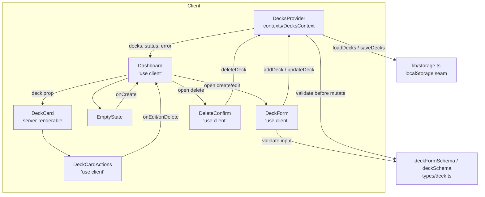

# Design Document

## Overview

Deck CRUD (slice 2 of 6) turns the read-only Dashboard from slice 1 into a manageable
deck library. It adds the ability to **create**, **edit**, and **delete** decks through
a Zod-validated form/modal, with deletion gated behind an explicit confirmation dialog.

The design builds directly on the seams already established in slice 1 and changes as
little as possible:

- **`types/deck.ts`** stays the single source of truth. We extend `deckSchema`/`Deck`
  with a `createdAt` ISO 8601 timestamp and add a **new** `deckFormSchema` that validates
  only the user-editable fields (name, description). Types are `z.infer`red so runtime
  validation and compile-time types never drift.
- **`contexts/DecksContext.tsx`** remains the client-side single source of truth. We keep
  the existing hydration guard, persistence effect, and the discriminated-result pattern
  of `addDeck`, and add two new actions, `updateDeck` and `deleteDeck`, plus the
  `createdAt` assignment on create.
- **`lib/storage.ts`** is unchanged. Decks now carry a `createdAt` string, which
  round-trips through JSON like any other field.
- **`components/Dashboard.tsx`** stays a Client Component and becomes the owner of the
  form/dialog UI state. **`components/DeckCard.tsx`** stays a Server-renderable component;
  its interactive edit/delete controls live in a small client child so the card itself is
  not forced to `"use client"`.
- Two **new** client components, `components/DeckForm.tsx` and
  `components/DeleteConfirm.tsx`, provide the create/edit form and the delete confirmation.

Validation runs on the client (for UX) via `deckFormSchema`, and again inside the store
actions (for integrity) before the deck list is mutated — matching the requirement that
the store validate input before modifying state (Requirements 4.7, 4.8).

**Requirements coverage:** this overview frames Requirements 1–6; each section below maps
back to the specific acceptance criteria it satisfies.

## Architecture

### Layering

The feature preserves the slice-1 layering. Data and validation flow one direction on
input, and rendering flows back out from store state:

```
User → DeckForm / DeleteConfirm (client)
     → deckFormSchema (Zod, client-side validation)
     → DecksContext actions (addDeck / updateDeck / deleteDeck)  ← store validates again
     → lib/storage.ts (localStorage seam, never throws)
     → DecksContext state update
     → Dashboard re-render (DeckCard list / EmptyState / error)
```

- **Presentation** — `Dashboard`, `DeckCard`, `EmptyState`, `DeckForm`, `DeleteConfirm`.
  Only components that need interactivity are `"use client"`.
- **State & domain logic** — `DecksContext` holds the in-memory list, owns id/`createdAt`
  generation, enforces invariants, and translates persistence results into `DecksError`s.
- **Validation** — `deckFormSchema` and `deckSchema` in `types/deck.ts`.
- **Persistence** — `lib/storage.ts`, the sole `localStorage` seam.

### UI state ownership

The Dashboard owns a small piece of local UI state describing which overlay (if any) is
open and, for edit/delete, which deck it targets. Lifting this state to the Dashboard
keeps `DeckCard` free of overlay concerns and lets the empty-state "Create deck" button
and each card's controls open the same form.

```ts
type DashboardOverlay =
  | { kind: "closed" }
  | { kind: "create" }
  | { kind: "edit"; deck: Deck }
  | { kind: "delete"; deck: Deck };
```

- **Create** entry points (Dashboard header button and `EmptyState` "Create deck") set
  `{ kind: "create" }`.
- **Edit** on a card sets `{ kind: "edit", deck }`.
- **Delete** on a card sets `{ kind: "delete", deck }`.
- Closing any overlay returns to `{ kind: "closed" }`.

Because `DeckCard` is server-renderable, the per-card edit/delete buttons live in a tiny
client component (`DeckCardActions`) that receives the target deck plus open callbacks
from the Dashboard. This keeps interactivity at the leaf while `DeckCard` stays a plain
prop-driven component. (Requirements 1.1, 2.1, 3.1)

### Component/data-flow diagram



## Components and Interfaces

### `types/deck.ts` (extended)

Extend `deckSchema` with `createdAt` and add a dedicated form schema.

```ts
import { z } from "zod";

// ISO 8601 timestamp: non-empty, 1–30 chars, and parseable as a real date.
const isoTimestamp = z
  .string()
  .min(1)
  .max(30)
  .refine((s) => !Number.isNaN(Date.parse(s)), {
    message: "createdAt must be a valid ISO 8601 timestamp",
  });

export const cardSchema = z.object({ id: z.string().min(1) });

export const deckSchema = z.object({
  // Identifier valid for both an export filename and a route param.
  id: z.string().min(1).max(100),
  name: z.string().min(1).max(100),
  description: z.string().max(500).optional(),
  cards: z.array(cardSchema).max(1000),
  createdAt: isoTimestamp,
});

export const deckListSchema = z.array(deckSchema).max(10_000);

// New: validates only the user-editable form fields (create + edit).
export const deckFormSchema = z.object({
  name: z.string().trim().min(1, "Name is required").max(100, "Name exceeds 100 characters"),
  description: z
    .string()
    .max(500, "Description exceeds 500 characters")
    .optional(),
});

export type Card = z.infer<typeof cardSchema>;
export type Deck = z.infer<typeof deckSchema>;
export type DeckList = z.infer<typeof deckListSchema>;
export type DeckFormInput = z.infer<typeof deckFormSchema>;
```

The `id` gains a `.max(100)` bound so it is safe as an export filename (slice 5) and a
route parameter (slice 3). `types/index.ts` barrel-exports the new `deckFormSchema` and
`DeckFormInput`. (Requirements 6.1, 6.2, 6.3, 6.4, 6.5, 6.6)

### `contexts/DecksContext.tsx` (extended)

Keep the existing provider shape, hydration guard (`loadedRef`), hydration effect, and
persistence effect. Add `updateDeck` and `deleteDeck` following the same
discriminated-result pattern as `addDeck`, and set `createdAt` on create.

```ts
export type DecksError =
  | { code: "name-required"; message: string }
  | { code: "duplicate-id"; message: string }
  | { code: "persistence"; message: string }
  | { code: "invalid-data"; message: string }
  | { code: "validation"; message: string; fields: Partial<Record<"name" | "description", string>> }
  | { code: "not-found"; message: string };

export interface UpdateDeckInput {
  id: string;
  name: string;
  description?: string;
}

export type UpdateDeckResult =
  | { ok: true; deck: Deck }
  | { ok: false; error: DecksError };

export type DeleteDeckResult =
  | { ok: true; id: string }
  | { ok: false; error: DecksError };

export interface DecksContextValue {
  decks: DeckList;
  status: DecksStatus;
  error: DecksError | null;
  addDeck: (input: AddDeckInput) => AddDeckResult;
  updateDeck: (input: UpdateDeckInput) => UpdateDeckResult;
  deleteDeck: (id: string) => DeleteDeckResult;
}
```

**`addDeck` change** — set `createdAt` at creation time and initialize `cards` to `[]`:

```ts
const deck: Deck = {
  id,
  name,
  cards: input.cards ?? [],
  createdAt: new Date().toISOString(),
  ...(description ? { description } : {}),
};
```

**`updateDeck`** — validate with `deckFormSchema`, locate the deck by id, and replace only
`name`/`description` while preserving `id`, `createdAt`, and `cards`:

```ts
const updateDeck = useCallback((input: UpdateDeckInput): UpdateDeckResult => {
  const parsed = deckFormSchema.safeParse({ name: input.name, description: input.description });
  if (!parsed.success) {
    const error = toValidationError(parsed.error); // maps field issues → { code: "validation", fields }
    setError(error);
    return { ok: false, error };
  }

  const index = decks.findIndex((d) => d.id === input.id);
  if (index === -1) {
    const error: DecksError = { code: "not-found", message: `No deck with id "${input.id}".` };
    setError(error);
    return { ok: false, error }; // list unchanged (Requirement 2.8)
  }

  const description = parsed.data.description?.trim();
  const existing = decks[index];
  const updated: Deck = {
    ...existing,                 // preserves id, createdAt, cards
    name: parsed.data.name,      // already trimmed by schema
    ...(description ? { description } : { description: undefined }),
  };

  setError(null);
  setDecks((prev) => prev.map((d) => (d.id === input.id ? updated : d)));
  return { ok: true, deck: updated };
}, [decks]);
```

**`deleteDeck`** — remove by id; a non-existent id is a no-op returning a `not-found`
error so the caller can distinguish it, while leaving the list unchanged:

```ts
const deleteDeck = useCallback((id: string): DeleteDeckResult => {
  if (!decks.some((d) => d.id === id)) {
    const error: DecksError = { code: "not-found", message: `No deck with id "${id}".` };
    return { ok: false, error }; // no removal, list unchanged (Requirement 3.9)
  }
  setError(null);
  setDecks((prev) => prev.filter((d) => d.id !== id));
  return { ok: true, id };
}, [decks]);
```

The existing persistence effect writes on every `[decks]` change, so create/edit/delete
each trigger a `saveDecks`; a write failure surfaces a `persistence` error while the
in-memory list is retained (Requirements 1.7, 1.9, 2.7, 3.5, 3.6, 5.4). (Requirements
1.2–1.5, 2.2–2.5, 2.8, 3.3, 3.9)

### `components/DeckForm.tsx` (new, `"use client"`)

A controlled form used for both create and edit. It owns local field state and per-field
error state, validates with `deckFormSchema` on submit, retains user input on failure, and
maps Zod issues to inline messages beside the offending field.

```ts
type DeckFormMode =
  | { kind: "create" }
  | { kind: "edit"; deck: Deck };

interface DeckFormProps {
  mode: DeckFormMode;
  onClose: () => void;
}
```

Behavior:

- **Create mode** starts with empty `name`/`description`; **edit mode** pre-fills from
  `mode.deck` (Requirements 1.1, 2.1).
- On submit, parse `{ name, description }` with `deckFormSchema`. On failure, set
  field-level errors from `error.issues` (keyed by `issue.path[0]`), keep the entered
  values, and do not call the store (Requirements 4.3, 4.4, 4.5, 4.6).
- On success, call `addDeck` (create) or `updateDeck` (edit). If the store returns a
  `validation`/`not-found`/`persistence` error, surface it; otherwise close the overlay
  (Requirements 1.2, 2.2, 2.8).

Accessibility: the form is rendered inside a modal with `role="dialog"`,
`aria-modal="true"`, and `aria-labelledby` pointing at its heading; each input has an
associated `<label>` and `aria-describedby` linking to its error text; the error text uses
`role="alert"`. Styling uses the AWS palette (primary submit `bg-aws-orange` with
`text-aws-squid-ink` and `hover:bg-aws-orange-dark`; cancel as a neutral/blue secondary),
mobile-first with `sm:` layout refinements.

### `components/DeleteConfirm.tsx` (new, `"use client"`)

A confirmation dialog shown before deletion. It displays the target deck's name and
presents exactly one confirm and one cancel control.

```ts
interface DeleteConfirmProps {
  deck: Deck;
  onConfirm: () => void; // Dashboard calls deleteDeck(deck.id)
  onCancel: () => void;  // closes and returns focus to the trigger
}
```

Behavior and accessibility:

- Renders `role="alertdialog"`, `aria-modal="true"`, labelled by a heading that includes
  `deck.name` (Requirement 3.1).
- Exactly one confirm control (`bg-aws-error` destructive styling with a text label — never
  color alone) and one cancel control; no deletion happens without the confirm click
  (Requirement 3.2).
- On mount, focus moves to the dialog (defaulting to the cancel control as the safe
  default); on cancel or confirm, focus returns to the delete trigger that opened it
  (Requirement 3.8). Escape triggers cancel.

### `components/DeckCardActions.tsx` (new, `"use client"`)

A small client leaf rendered inside/alongside `DeckCard` that exposes per-card **Edit** and
**Delete** buttons and calls back to the Dashboard's overlay openers. Keeping this separate
lets `DeckCard` remain a prop-driven, server-renderable component.

```ts
interface DeckCardActionsProps {
  deck: Deck;
  onEdit: (deck: Deck) => void;
  onDelete: (deck: Deck) => void;
}
```

### `components/Dashboard.tsx` (extended)

Adds the `DashboardOverlay` state, a "New deck" header entry point, and conditional
rendering of `DeckForm`/`DeleteConfirm`. It passes overlay-open callbacks down to
`DeckCardActions` and to `EmptyState`. The existing status branches (`error`, empty,
listing) are preserved; the listing branch now renders each `DeckCard` with its actions.
(Requirements 1.6, 2.6, 3.4)

### `components/EmptyState.tsx` (extended)

The existing "Create deck" button is wired to an `onCreate` callback provided by the
Dashboard so it opens the form in create mode. The "Import deck" button remains a stub for
a later slice. (Requirement 1.1)

## Data Models

### `Deck` (extended)

```ts
interface Deck {
  id: string;          // 1–100 chars; safe as filename + route param
  name: string;        // 1–100 chars, trimmed
  description?: string; // optional, ≤ 500 chars
  cards: Card[];       // ≤ 1000; initialized to [] on create
  createdAt: string;   // ISO 8601 timestamp, set once, preserved across edits
}
```

### `DeckFormInput` (new)

```ts
interface DeckFormInput {
  name: string;        // trimmed, 1–100
  description?: string; // ≤ 500
}
```

### `createdAt` design decision

`createdAt` is stored as an **ISO 8601 string** produced by `new Date().toISOString()` at
creation time. Rationale:

- **Serialization**: strings survive `JSON.stringify`/`parse` round-trips through
  `localStorage` with no custom (de)serialization — a `Date` object would serialize to a
  string anyway and require re-hydration on load.
- **Validation**: the schema bounds it to 1–30 chars and requires `Date.parse` to succeed,
  rejecting empty or malformed values (Requirements 6.2, 6.3).
- **Immutability**: it is assigned only in `addDeck`. `updateDeck` copies the existing deck
  and never overwrites `createdAt`, so it is preserved across edits (Requirement 2.4).

### Persistence

No changes to `lib/storage.ts`. `saveDecks`/`loadDecks` continue to serialize/validate the
whole `DeckList`; the added `createdAt` field is included automatically and validated by
`deckListSchema` on load. (Requirements 1.7, 2.7, 3.5, 5.1, 5.5)

### Test arbitraries (`test/arbitraries.ts`)

`arbDeck` must be updated to include a `createdAt` that satisfies the schema — a valid ISO
timestamp within the 1–30 char bound (e.g. map a bounded `fc.date()` through
`.toISOString()`). Add an `arbCreatedAt` helper and reuse it in `arbDeck` and
`arbLargeDeckList`. Add an `arbDeckFormInput` (valid name/description) and companion
invalid arbitraries (whitespace-only or overlong name, overlong description) for the
validation properties.

## Correctness Properties

*A property is a characteristic or behavior that should hold true across all valid
executions of a system — essentially, a formal statement about what the system should do.
Properties serve as the bridge between human-readable specifications and machine-verifiable
correctness guarantees.*

This slice is well suited to property-based testing because the store actions, schema
validation, and persistence are pure input/output logic with universal invariants (append,
preservation, idempotence, round-trips, rejection). It reuses the existing `fast-check`
setup and arbitraries. UI structure, focus management, and specific render assertions are
covered by example-based unit tests instead (see Testing Strategy).

The properties below are the **new** properties introduced by this slice. Two existing
slice-1 properties are **extended** to carry `createdAt` — namely the slice-1 deck schema
validation round-trip and the slice-1 persistence round-trip. The slice-1 write-failure,
load-resilience, and hydration-determinism properties already cover Requirements 1.9, 3.6,
5.2, 5.3, 5.4, and 5.5 and need no change beyond the updated `createdAt`-carrying
arbitraries.

### Property 1: Creating a valid deck assigns a unique id, a valid createdAt, and empty cards

*For any* prior deck list and *any* valid form input (a name of 1–100 characters after
trimming and an optional description of at most 500 characters), `addDeck` appends exactly
one deck whose `id` is a non-empty string distinct from every existing id, whose
`createdAt` is a string that parses as a valid ISO 8601 timestamp, and whose `cards` is an
empty array; the trimmed name and description match the input.

**Validates: Requirements 1.2, 1.3, 1.4, 1.5**

### Property 2: Updating a deck preserves id, createdAt, and cards while replacing only name and description

*For any* deck list containing a deck with a given id and *any* valid form input, calling
`updateDeck` for that id yields a deck with the same `id`, the same `createdAt`, and a
deeply-equal `cards` array as before, and with `name`/`description` set to the submitted
trimmed values; no other deck in the list changes.

**Validates: Requirements 2.2, 2.3, 2.4, 2.5**

### Property 3: Updating a non-existent id is a no-op that returns an error

*For any* deck list and *any* id that is not present in that list, calling `updateDeck`
with that id returns an error result with code `not-found` and leaves the deck list
unchanged (same decks, fields, and order).

**Validates: Requirements 2.8**

### Property 4: Deleting removes exactly the target deck and is idempotent for absent ids

*For any* deck list, deleting a present id removes exactly the deck with that id (all other
decks retained in their original order), and deleting an absent id — or deleting the same
id a second time — leaves the deck list unchanged; that is, `deleteDeck(id)` applied twice
produces the same list as applying it once.

**Validates: Requirements 3.3, 3.9**

### Property 5: Invalid input is rejected, leaves the list unchanged, and identifies each invalid field

*For any* deck list and *any* invalid form input — a name that is empty, whitespace-only,
or longer than 100 characters, and/or a description longer than 500 characters — both
`addDeck` and `updateDeck` reject the change, leave the deck list unchanged, and return a
validation error whose fields identify each invalid field (`name` and/or `description`).

**Validates: Requirements 1.8, 2.9, 4.1, 4.2, 4.3, 4.4, 4.5, 4.6, 4.7, 4.8**

### Property 6: Deck schema validation round-trip (extended for createdAt and id bounds)

*For any* valid deck (including a `createdAt` that parses as a valid ISO 8601 timestamp of
1–30 characters and an `id` of 1–100 valid characters), `deckSchema.parse` returns a value
equal to the input; and *for any* deck that violates at least one constraint — including an
empty/non-string/unparseable `createdAt` or an empty/overlong `id` — `deckSchema.safeParse`
reports failure.

**Validates: Requirements 6.1, 6.2, 6.3, 6.5, 6.6**

### Property 7: Persistence round-trip preserves the deck list including createdAt (extended)

*For any* valid deck list (whose decks now carry `createdAt`), `saveDecks` followed by
`loadDecks` yields an equal deck list — same decks, same fields (including `createdAt`), in
the same order.

**Validates: Requirements 1.7, 2.7, 3.5, 5.1**

## Error Handling

All failures are represented as data, never thrown across a render boundary, consistent
with slice 1.

- **Form validation (client)** — `DeckForm` parses input with `deckFormSchema` on submit.
  On failure it maps `error.issues` to per-field messages (keyed by `issue.path[0]`),
  renders them inline with `role="alert"` beside the offending field, retains the entered
  values, and does not call the store (Requirements 4.3, 4.4, 4.5, 4.6).

- **Store validation (integrity)** — `addDeck`/`updateDeck` re-validate with
  `deckFormSchema` before mutating. On failure they set and return a
  `{ code: "validation", fields }` error and leave the list unchanged (Requirements 4.7,
  4.8). `DeckForm` maps any returned `fields` back onto the inputs.

- **Not found** — `updateDeck`/`deleteDeck` for an unknown id return `{ code: "not-found" }`
  and perform no mutation (Requirements 2.8, 3.9).

- **Duplicate id** — `addDeck` retains its existing `duplicate-id` guard.

- **Persistence failure** — the existing persistence effect surfaces
  `{ code: "persistence" }` when `saveDecks` fails, while the in-memory list is retained.
  The Dashboard already renders a persistence/error affordance; the just-created/edited
  deck stays visible (Requirements 1.9, 3.6, 5.4).

- **Invalid stored data on load** — unchanged: `loadDecks` returning `invalid` yields an
  empty list, `status: "ready"`, and an `invalid-data` error (Requirement 5.5).

- **Delete confirmation** — deletion only proceeds via the explicit confirm control;
  cancel and Escape are no-ops on the list and return focus to the trigger (Requirements
  3.2, 3.7, 3.8).

## Testing Strategy

Testing uses the existing **Vitest** + **@testing-library/react** + **fast-check 4.9**
setup. Property tests reuse `test/arbitraries.ts`. Every property test runs a minimum of
**100 iterations** and is tagged with a comment in the established format:

```
// Feature: deck-crud, Property N - <property text>
// Validates: Requirements X.Y
```

### Arbitraries to add/update (`test/arbitraries.ts`)

- Add `arbCreatedAt`: a valid ISO 8601 string within 1–30 chars (e.g. a bounded
  `fc.date()` mapped through `.toISOString()`).
- Update `arbDeck` and `arbLargeDeckList` to include `createdAt` from `arbCreatedAt` so the
  extended schema and persistence round-trips validate.
- Add `arbDeckFormInput` (valid name 1–100, optional description ≤500) and invalid
  companions: `arbWhitespaceName`, `arbOverlongName` (>100), `arbOverlongDescription`
  (>500) for Property 5.
- Add an `arbInvalidCreatedAt` (empty, whitespace, non-ISO strings) and `arbInvalidId`
  (empty, >100 chars) for the extended schema-rejection branch (Property 6).

### Property-based tests (universal correctness)

Implement each correctness property with a **single** `fast-check` property test at
100+ runs:

| Property | Suggested location | Validates |
| --- | --- | --- |
| 1 — create assignment | `contexts/DecksContext.create-assignment.test.tsx` | 1.2–1.5 |
| 2 — update preservation | `contexts/DecksContext.update-preservation.test.tsx` | 2.2–2.5 |
| 3 — update unknown id no-op | `contexts/DecksContext.update-not-found.test.tsx` | 2.8 |
| 4 — delete removal + idempotence | `contexts/DecksContext.delete.test.tsx` | 3.3, 3.9 |
| 5 — validation rejection | `contexts/DecksContext.validation.test.tsx` | 1.8, 2.9, 4.1–4.8 |
| 6 — schema round-trip (extended) | `types/deck.test.ts` (extend existing) | 6.1–6.3, 6.5, 6.6 |
| 7 — persistence round-trip (extended) | `lib/storage.test.ts` (extend existing) | 1.7, 2.7, 3.5, 5.1 |

The existing slice-1 properties (write-failure, load-resilience, hydration determinism)
continue to cover Requirements 1.9, 3.6, 5.2, 5.3, 5.4, 5.5 once their arbitraries carry
`createdAt`.

### Example-based unit tests (specific scenarios, UI, accessibility)

These cover acceptance criteria that are specific interactions, rendering assertions, or
focus behavior rather than universal properties:

- **DeckForm** — opens empty in create mode (1.1); opens pre-filled in edit mode (2.1);
  retains user input after a validation failure and shows the field-specific message (4.3,
  4.4, 4.5); has labelled inputs and `role="dialog"`/`aria-modal`.
- **DeleteConfirm** — displays the target deck name (3.1); presents exactly one confirm and
  one cancel control and does not delete without confirm (3.2); cancel closes and returns
  focus to the trigger (3.8); Escape cancels.
- **Dashboard** — the create entry point and `EmptyState` "Create deck" open the form
  (1.1); a newly added deck renders as a `DeckCard` (1.6); an edited deck shows updated
  name/description (2.6); a deleted deck no longer renders (3.4); cancelling delete leaves
  the listing unchanged (3.7).
- **Type-level check** — `DeckFormInput = z.infer<typeof deckFormSchema>` exists and is
  used by `DeckForm` (6.4), enforced by `tsc`.

### Balance

The property tests carry the burden of input coverage (append/preservation/idempotence/
round-trip/rejection across many generated inputs). Unit tests stay focused on concrete
examples, component wiring, and accessibility/focus behavior — avoiding redundant
enumeration that the property tests already cover.
