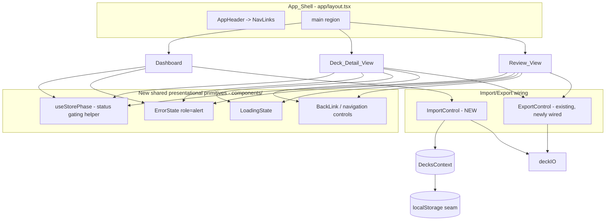

# Design Document: Polish, Responsiveness & End-to-End Wiring

## Overview

This is the sixth and final vertical slice (6/6). It is a hardening and polish
pass that integrates and refines what slices 1–5 delivered
(walking-skeleton, deck-crud, deck-detail-cards, review-session,
json-import-export). It introduces **no new domain logic** — every rule about
decks, cards, validation, the Leitner schedule, and persistence already lives in
`@/lib` and `@/contexts/DecksContext`. This slice constrains how existing
screens *present* and *integrate* that logic.

The design delivers, per the ten requirements:

1. **Consistent navigation** — a shared, prop-driven back/forward control
   pattern across the Dashboard, Deck_Detail_View, and Review_View, plus the
   existing route-aware `NavLinks` active state (`aria-current` + a non-color
   indicator), and Dashboard escape hatches from the not-found and
   completion-summary states.
2. **Standardized Loading / Empty / Error rendering** — a single status-gating
   pattern derived from the `Decks_Store` `status`, applied uniformly so that
   for any store state exactly one of Loading / Empty / Error / Content renders.
3. **In-view error states** — replacing the review page's `alert()` for
   grade-persistence failures with an accessible `role="alert"` region rendered
   inside the view.
4. **Post-review export reminder** — wiring the already-built `ExportControl`
   into the review completion summary.
5. **Import flow completion** — the json-import-export slice *designed* an
   `ImportControl` and a `replaceDeck` store method but **never implemented
   them**; the `Import deck` button on `EmptyState` is a dead stub. This slice
   completes that wiring because Requirements 3.1, 4.5, 5.2, 10.1, 10.2, and
   10.6 depend on a working import flow. This is integration of already-designed
   behavior, not new domain logic.
6. **Mobile-first responsiveness** with Tailwind `sm:`/`md:`/`lg:` prefixes and
   AWS_Palette tokens, with `aws-orange` reserved as an accent.
7. **Hydration guard** — the `Decks_Store` already implements the guard; this
   slice verifies and normalizes it and removes the last direct-during-render
   read paths.
8. **Quality gate** — clean `npm run lint` and `npm run build`, no dead code,
   no dev-only scaffolding, no hydration warnings.

### Reconciling requirement vocabulary with the code

The requirements glossary describes the `Decks_Store` status as
`loading | ready | error`. The **actual** store
(`contexts/DecksContext.tsx`) exposes `status: "initial" | "ready" | "error"`,
where `"initial"` is the pre-hydration state the requirements call
`Loading_State`. Rather than churn the store's public type across the whole
test suite, this design treats `"initial"` as the concrete representation of the
`loading` state. A shared helper maps store status to a rendered "phase" so the
naming difference is contained in one place (see Components and Interfaces).

## Architecture

### What already exists (and is reused unchanged)

| Concern | Module | Status |
| --- | --- | --- |
| Deck/card domain + Zod schemas | `types/deck.ts` | reused as-is |
| Persistence seam (localStorage) | `lib/storage.ts` | reused as-is |
| Serialize/parse for JSON files | `lib/deckIO.ts` | reused as-is |
| Leitner schedule | `lib/leitner.ts` | reused as-is |
| Store + hydration guard + CRUD/grade | `contexts/DecksContext.tsx` | reused; one method added (`replaceDeck`) for import duplicate resolution |
| Export UI | `components/ExportControl.tsx` | reused; newly *wired* into deck detail + review summary |
| Route-aware nav | `components/NavLinks.tsx` | reused; active-state pattern kept |
| App chrome | `components/AppHeader.tsx`, `app/layout.tsx` | reused; sticky header confirmed |

### What this slice adds or refactors



### Design principle: gate, don't scatter

Today each screen re-implements its own status branching inline (the Dashboard
checks `status === "error"` then `decks.length === 0`; the deck/review pages
check `status !== "ready"` then not-found). The branches are subtly
inconsistent — the Dashboard treats `"initial"` as "render content with an empty
list" while the deck pages treat it as "loading". This slice replaces the
ad-hoc branching with a single derivation:

> Given the store `status` and a screen-specific *content resolver*, compute
> exactly one **phase** — `loading | empty | error | content` — and render the
> one matching view.

This guarantees the mutual-exclusion the requirements demand (2.1, 3.5, 4.1)
and makes the invariant testable as a property.

## Components and Interfaces

### 1. `useStorePhase` — shared status-gating helper (`contexts/` or `components/`)

A tiny pure helper (not a hook that touches the DOM) that maps the store status
plus a resolved-content descriptor into a single phase. Keeping it pure makes it
property-testable in isolation.

```ts
export type StorePhase = "loading" | "error" | "empty" | "content";

export interface PhaseInput {
  /** Store status; "initial" is treated as the loading phase. */
  status: DecksStatus;              // "initial" | "ready" | "error"
  /** True when the store surfaced an error to show (e.g. persistence/invalid-data). */
  hasError: boolean;
  /** True when the screen's resolved content is empty (0 decks, 0 cards, 0 due). */
  isEmpty: boolean;
}

export function resolvePhase({ status, hasError, isEmpty }: PhaseInput): StorePhase {
  if (status === "initial") return "loading";
  if (status === "error" || hasError) return "error";
  if (isEmpty) return "empty";
  return "content";
}
```

Precedence is fixed and total: **loading → error → empty → content**. Every
possible `(status, hasError, isEmpty)` triple yields exactly one phase, which is
the core invariant (Property 1). Screens compute `isEmpty`/`hasError` from their
own resolved data (e.g. deck-not-found is an error for the detail/review views;
zero decks is empty for the Dashboard).

Note: deck-not-found is not a store `status`; it is a screen-local condition the
screen folds into `hasError` (Requirements 4.2, 4.3). "No cards due" in the
Review_View is folded into `isEmpty` (Requirement 3.3).

### 2. `LoadingState` — shared presentational component (`components/LoadingState.tsx`)

A Server Component (no interactivity) rendering a consistent, centered loading
indication. Accepts an optional `label` (default "Loading…"). Replaces the three
divergent inline "Loading deck…" / "Loading review session…" blocks so all three
screens read identically (Requirements 2.1–2.3).

```tsx
interface LoadingStateProps { label?: string; }
```

Accessibility: the region uses `role="status"` and `aria-live="polite"` so the
transition out of loading is announced without stealing focus.

### 3. `ErrorState` — shared presentational component (`components/ErrorState.tsx`)

A Server Component rendering an accessible alert. This is the single source of
truth for every error surface (store error, deck-not-found, grade-persistence
failure, import failure), replacing the copy-pasted `role="alert"` blocks and
the review page's `alert()` call (Requirements 4.1–4.6).

```tsx
interface ErrorStateProps {
  /** Non-empty human-readable message; rendered as text (never color alone). */
  message: string;
  /** Optional heading; defaults to "Something went wrong". */
  title?: string;
  /** Optional slot for a recovery/navigation control (e.g. Back to Dashboard). */
  action?: React.ReactNode;
}
```

- Wrapping element carries `role="alert"` so assistive tech announces it
  (Requirement 4.6).
- The failure is conveyed via text content; the `aws-error` border/accent is
  paired with the text, never the sole signal (Requirements 4.6, 7.4).
- The optional `action` slot lets the not-found views embed a "Back to
  Dashboard" control (Requirement 1.9).

### 4. Navigation controls — shared `BackLink` (`components/BackLink.tsx`)

A thin, styled wrapper over `next/link` for the repeated back/forward
affordances, so the three screens present a consistent control rather than
bespoke inline links.

```tsx
interface BackLinkProps {
  href: string;
  children: React.ReactNode;
  /** "secondary" (aws-blue) default; "primary" (aws-orange accent) for the main CTA. */
  variant?: "primary" | "secondary";
}
```

Navigation controls required per screen:

| Screen | Control | Target | Requirement |
| --- | --- | --- | --- |
| Deck_Detail_View | Back to Dashboard | `/` | 1.3 |
| Deck_Detail_View | Start review | `/deck/[id]/review` | 1.4 |
| Review_View (active/empty) | Back to deck | `/deck/[id]` | 1.5, 3.3 |
| Review_View (completion) | Back to Dashboard | `/` | 1.6 |
| Deck_Detail_View (not found) | Back to Dashboard | `/` | 1.9 |
| Review_View (not found) | Back to Dashboard | `/` | 1.9 |

`NavLinks` keeps its existing active-state treatment: `aria-current="page"`
plus a persistent bottom border and bold weight — a non-color indicator
(Requirement 1.2). It stays reachable at every breakpoint because the header
stacks vertically below `md:` and rows at `md:` (Requirement 1.8).

### 5. `ImportControl` — new import UI (`components/ImportControl.tsx`)

Completes the import flow the prior slice designed but never implemented. It is
a Client Component (file input + async read + store writes).

```tsx
interface ImportControlProps {
  /** "primary" | "secondary" styling to match the surface it renders on. */
  variant?: "primary" | "secondary";
}
```

Behavior:
1. Renders a labelled, keyboard-focusable control that opens a hidden
   `<input type="file" accept="application/json,.json">` (Requirement 3.1).
2. On selection, reads the file text (`file.text()`), then validates via
   `parseDeck` from `lib/deckIO.ts` (reused).
3. On parse/validation failure → render an inline `ErrorState`, leave the store
   unchanged (Requirements 4.5, 10.2).
4. On success with a new id → `addDeck({ id, name, description, cards })`; the
   deck appears in the listing (Requirements 10.1).
5. On success with a duplicate id → `replaceDeck(id, deck)` (see below). Keeping
   duplicate handling as "replace" keeps this slice's scope to *wiring* rather
   than re-litigating the prior slice's modal UX; the round-trip requirement
   (10.6) only needs a deterministic outcome.

The `EmptyState` "Import deck" stub button is replaced by an `ImportControl`
(Requirement 3.1). A second `ImportControl` is available on the Dashboard's
non-empty listing header so import is reachable whether or not decks exist.

### 6. `DecksContext` — add `replaceDeck`

The only store change. It adds the method the json-import-export design listed
as "New Method (if not already present)" — it is not present. No new domain
logic: it replaces a deck by id using the same immutable-update + persistence
path as the existing mutators.

```ts
replaceDeck: (id: string, deck: Deck) => DeleteDeckResult;
// { ok: true, id } when a deck with that id existed and was replaced,
// { ok: false, error: { code: "not-found" } } otherwise.
```

### 7. Screen refactors

**Dashboard (`components/Dashboard.tsx`)** — replace the inline
error/empty/listing branches with `resolvePhase({ status, hasError: status === "error", isEmpty: decks.length === 0 })`
and render `LoadingState` / `ErrorState` / `EmptyState` / listing accordingly.
Today the Dashboard renders the listing during `"initial"` with an empty array;
after this change it renders `LoadingState` while `"initial"` (Requirements 2.1,
2.4, 3.5).

**Deck_Detail_View (`app/deck/[id]/page.tsx`)** — resolve the deck by id, fold
not-found into `hasError`, fold zero-cards into `isEmpty`, then render via the
shared phase. Add `BackLink` to Dashboard and a "Start review" control in the
header (Requirements 1.3, 1.4, 2.2, 3.2, 4.2). Wire an `ExportControl` into the
header.

**Review_View (`app/deck/[id]/review/page.tsx`)** — the largest refactor:
- Route the deck-not-found and loading states through the shared phase
  (Requirements 2.3, 4.3).
- Replace both `alert("Failed to save your progress…")` calls with an in-view
  `ErrorState`. On grade failure, set a local `gradeError` message, render the
  `ErrorState`, and **do not advance** `currentCardIndex` or change counts
  (Requirement 4.4).
- "No cards due" empty view keeps its "Back to deck" `BackLink` (Requirement
  3.3).
- Completion summary keeps "Back to Dashboard" (Requirement 1.6) and, when at
  least one card was graded, renders the export reminder wired to
  `ExportControl` for this deck (Requirements 5.1, 5.2). When zero cards were
  graded, the reminder is omitted (Requirement 5.3). An export failure from the
  summary surfaces `ExportControl`'s existing inline error and leaves review
  state unchanged (Requirement 5.4).

### Responsive & palette conventions

- **Mobile-first**: author base (single-column) styles, layer with `sm:`
  (≥640px), `md:` (≥768px), `lg:` (≥1024px). Listings use
  `grid-cols-1 sm:grid-cols-2 lg:grid-cols-3` (already the pattern in
  `Dashboard`/`CardList`); content is capped with `max-w-*` and centered so no
  horizontal scroll appears at any width (Requirements 6.1–6.4).
- **Sticky header** stays via `sticky top-0 z-10` on `AppHeader` (Requirement
  6.5).
- **Palette**: only `theme.extend.colors.aws` tokens; no hardcoded hex outside
  the token set (Requirement 7.1). `aws-squid-ink` header on `aws-white` text
  meets ≥4.5:1 (Requirements 1.7, 7.2). `aws-orange` is used only for accents
  and CTAs, never as a large-area background fill (Requirement 7.3). Semantic
  colors (`aws-success`/`aws-error`) always accompany a text label
  (Requirement 7.4).

### Hydration guard

The store already implements the guard correctly: it seeds a deterministic empty
list, defers the `loadDecks()` read into a mount `useEffect`, and reconciles
after mount (Requirements 8.1–8.4). The Review_View currently seeds its
`reviewState` during render inside an `if (status === "ready" …) setReviewState(...)`
block; this design moves review-session initialization into a mount-gated effect
(or derives it lazily) so no state is written during the first render, keeping
server and first-client markup identical. `LoadingState` is the shared
pre-mount/`initial` render for all three screens, guaranteeing markup match
(Requirement 8.2). A failed post-mount read falls back to the empty state via
the store's existing `invalid-data` handling (Requirement 8.4).

### Cleanup / quality gate

- Remove the dead `Import deck` stub button once `ImportControl` replaces it
  (Requirement 9.3, 9.4).
- Wire the previously-orphaned `ExportControl` so it is referenced by a route
  (Requirement 9.4).
- Verify no other unreferenced components/modules remain (sweep `components/`,
  `lib/`, `contexts/` for exports with zero importers).
- Any inline ESLint disable must carry a justification comment; the store's
  existing `react-hooks/set-state-in-effect` disables already do (Requirement
  9.5).
- `npm run lint` and `npm run build` must exit clean (Requirements 9.1, 9.2).

## Data Models

No new persisted data models. All shapes come from `types/deck.ts`
(`Card`, `Deck`, `DeckList`) and the store's existing result/error unions. The
only new *type* is the presentational `StorePhase` union and the `PhaseInput`
descriptor above — pure view-layer types, not domain data.

## Correctness Properties

*A property is a characteristic or behavior that should hold true across all
valid executions of a system — essentially, a formal statement about what the
system should do. Properties serve as the bridge between human-readable
specifications and machine-verifiable correctness guarantees.*

This is a polish/integration slice, so most acceptance criteria are UI presence,
navigation wiring, responsive layout, or accessibility checks that are best
verified with example-based React Testing Library tests or manual/visual review
(see Testing Strategy). Property-based testing is reserved for the small set of
pure, input-varying seams where it adds genuine value. After prework and
deduplication, the following six properties remain — each provides unique
validation value and consolidates several acceptance criteria.

### Property 1: Status gating yields exactly one phase

*For all* store states `(status, hasError, isEmpty)`, `resolvePhase` returns
exactly one phase from `{loading, error, empty, content}`, following the fixed
precedence loading → error → empty → content: `loading` iff `status` is the
pre-hydration (`initial`) state; otherwise `error` iff `status === "error"` or
`hasError`; otherwise `empty` iff `isEmpty`; otherwise `content`. In particular
the `empty` phase is reachable only when `status` is ready, and no two phases
are ever simultaneously selected.

**Validates: Requirements 2.1, 2.2, 2.3, 3.5, 4.1**

### Property 2: Navigation active state tracks the current path

*For all* pathnames, a `NavLinks` destination is marked active — carrying
`aria-current="page"` together with the persistent non-color indicator (bold
weight and bottom border) — if and only if its `href` equals the current
pathname; when no destination matches, no destination is active.

**Validates: Requirements 1.2**

### Property 3: A failed grade never advances the review session

*For all* review sessions and any current position, when the grade operation
returns a not-ok result, the Review_View renders an in-application alert region
(`role="alert"`) rather than invoking a browser dialog, and leaves the current
card index and the correct/incorrect counts unchanged (the session does not
advance).

**Validates: Requirements 4.4**

### Property 4: Invalid import input is rejected without mutating the store

*For all* file contents that are unreadable, unparseable, or structurally
invalid against `deckSchema`, `parseDeck` returns a not-ok result, so the
Import_Flow surfaces an Error_State and the Decks_Store deck list is left
unchanged.

**Validates: Requirements 4.5, 10.2**

### Property 5: First render is a deterministic empty seed

*For all* persisted deck-list contents in `Local_Storage`, the initial
pre-mount render of a `localStorage`-backed screen produces markup identical to
rendering with the empty seed (no read occurs during the first render), so the
server-rendered and initial client-rendered markup match and no hydration
warning is emitted.

**Validates: Requirements 8.1, 8.2**

### Property 6: Export → import round-trip preserves the deck

*For all* valid decks, serializing with `serializeDeck` and then parsing with
`parseDeck` yields an ok result whose deck has the same card count and the same
card contents as the original — so a deck exported after a review re-imports
without an Error_State and reproduces its cards.

**Validates: Requirements 5.2, 10.6**

## Error Handling

All error handling reuses the store's non-throwing, discriminated-result
approach and surfaces failures through the single shared `ErrorState`
(`role="alert"`, text-based, palette-paired). No error path throws or crashes a
render.

| Failure | Source | Surface | Store effect |
| --- | --- | --- | --- |
| Deck data fails to load (invalid persisted JSON) | `loadDecks` → store `status`/`error` | Dashboard `ErrorState` | store keeps empty list (Req 4.1, 8.4) |
| Deck id not in store | screen-local resolve | detail/review `ErrorState` + Back-to-Dashboard action | none (Req 4.2, 4.3, 1.9) |
| Grade fails to persist | `gradeCardCorrect`/`gradeCardIncorrect` returns not-ok | in-view `ErrorState`; session **not advanced** | in-memory state retained (Req 4.4) |
| Import file unreadable/unparseable/invalid | `file.text()` / `parseDeck` | `ImportControl` inline `ErrorState` | store unchanged (Req 4.5, 10.2) |
| Export fails | `ExportControl` catch | existing inline `role="alert"` message | review/deck state unchanged (Req 5.4) |
| localStorage write fails (quota/unavailable) | `saveDecks` → store `error` | store surfaces persistence error | in-memory list retained |

The review page's two `alert(...)` calls are removed entirely (Requirement 4.4);
grade-failure state becomes a local `gradeError: string | null` that renders an
`ErrorState` inside the active-session view without touching `currentCardIndex`
or the grade counters.

## Testing Strategy

The suite uses **Vitest** (`jsdom`, globals) with
**@testing-library/react** and **@testing-library/jest-dom**, colocating
`*.test.ts(x)` beside the code under test, consistent with slices 1–5.
**fast-check** provides the six property tests below; shared arbitraries live in
`@/test/arbitraries` (which already exports `arbDeck`, `arbPathname`,
`arbGarbageStorage`, `arbDeckList`, and more — reused directly).

### Dual approach

- **Unit / example tests (the majority here):** navigation control presence and
  targets, empty/loading/error rendering wiring per screen, focusability and
  activation of create/import/add-card controls, completion-summary reminder
  presence/absence, import success/failure flows, and end-to-end integration
  (import → detail → review → export). These cover the many EXAMPLE-classified
  criteria (1.1, 1.3–1.6, 1.8, 1.9, 2.4–2.6, 3.1–3.4, 4.2, 4.3, 4.6, 5.1–5.4,
  7.4, 8.3, 8.4, 10.1–10.5).
- **Property tests:** the six universal properties above.
- **Manual / smoke checks:** contrast ratios (1.7, 3.4, 7.2), true responsive
  layout and no-horizontal-scroll at mobile/tablet/desktop and sticky-header
  behavior (6.1–6.5), palette-token discipline (7.1, 7.3), and the quality gate
  (9.1–9.5). jsdom cannot measure layout or contrast, so these are verified by
  running `npm run lint` / `npm run build` and by class/token assertions plus a
  manual pass at the three breakpoints.

### Property test configuration

- A property-based library (fast-check) is used; property tests are **not**
  implemented from scratch.
- Each property is implemented by a **single** property-based test running a
  **minimum of 100 iterations**.
- Each test is tagged with a comment referencing its design property, in the
  format: **Feature: polish-responsiveness-e2e-wiring, Property {number}: {property_text}**.

| Property | Test location | Arbitraries |
| --- | --- | --- |
| 1 — phase gating | `contexts/useStorePhase.property.test.ts` (or colocated with the helper) | generated `(status, hasError, isEmpty)` triples |
| 2 — active nav | extend `components/NavLinks.test.tsx` | `arbPathname` (existing) |
| 3 — no advance on grade failure | `app/deck/[id]/review/grade-failure.property.test.tsx` | generated session sizes/positions with a forced-failure store stub |
| 4 — invalid import rejected | `components/ImportControl.property.test.tsx` (or `lib/deckIO`) | `arbGarbageStorage` (existing) |
| 5 — hydration determinism | reuse/extend `contexts/DecksContext.hydration-determinism.test.tsx` | `arbDeckList` (existing) |
| 6 — export/import round-trip | reuse/extend `lib/deckIO.test.ts` round-trip | `arbDeck` (existing) |

### Regression guard

Because this slice refactors existing screens, the full existing suite
(DecksContext, Dashboard, CardList, DeckForm, review persistence/integration,
storage, deckIO) must continue to pass. Where a refactor changes the
Dashboard's `"initial"` behavior (now `LoadingState` instead of an empty
listing), the affected `Dashboard.transitions`/`wiring` expectations are updated
to assert the loading phase, and the `EmptyState` "Import deck" assertions are
updated to target the new `ImportControl`.
