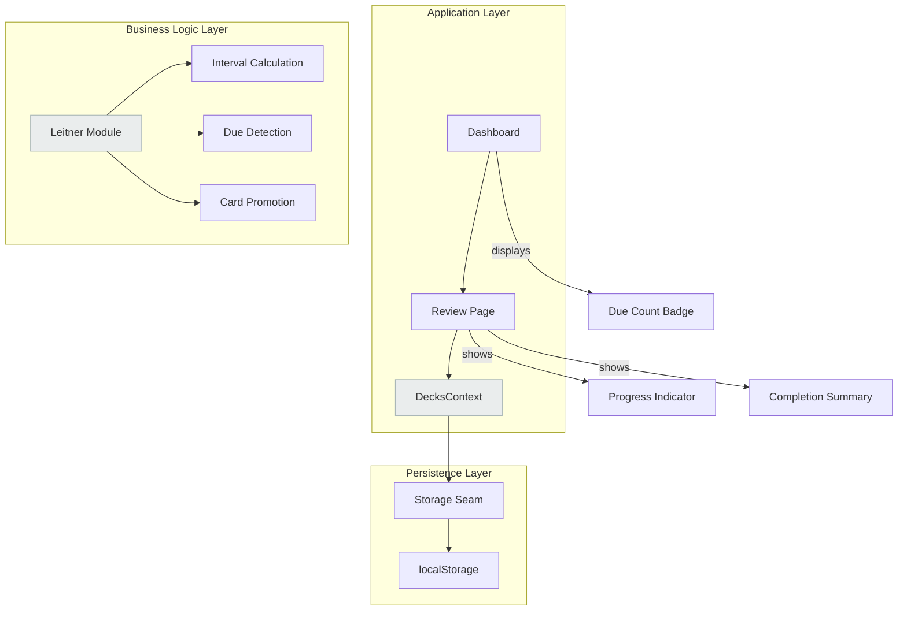
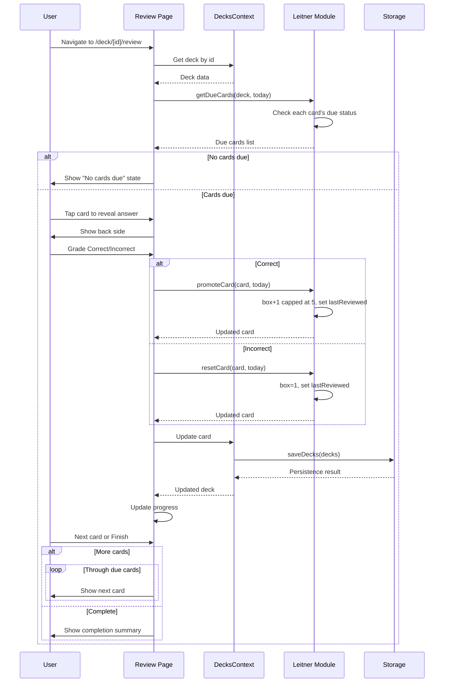
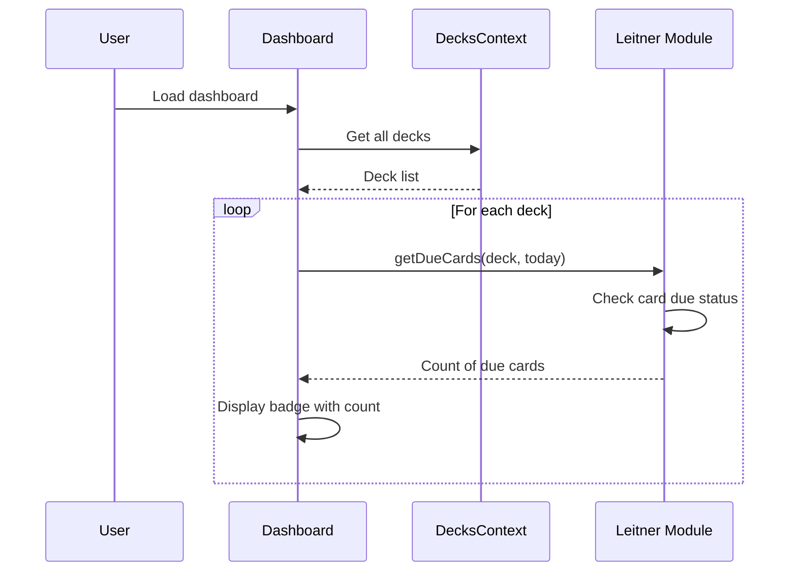

# Design Document: Review Session (Leitner)

## Overview

This feature implements a per-deck review session based on the Leitner spaced repetition system. Users can select a deck and study its due cards by revealing answers, grading themselves as Correct or Incorrect, and seeing the cards promoted (for correct answers) or reset (for incorrect answers) according to Leitner box rules. The dashboard surfaces due-today counts for each deck so users know what to study. All changes persist to localStorage via the existing `DecksContext`.

## Architecture



## Sequence Diagrams

### Review Session Flow



### Dashboard Due Count Flow



## Components and Interfaces

### Component 1: Leitner Module (`lib/leitner.ts`)

**Purpose**: Pure functions for Leitner spaced repetition logic

**Interface**:
```typescript
export interface LeitnerFunctions {
  getInterval(box: number): number;
  isDue(card: Card, today: Date): boolean;
  getDueCards(deck: Deck, today: Date): Card[];
  promoteCard(card: Card, today: Date): Card;
  resetCard(card: Card, today: Date): Card;
}

export type { Card, Deck } from "@/types";
```

**Responsibilities**:
- Calculate intervals for each Leitner box (1-5 days)
- Determine if a card is due based on last review and interval
- Filter a deck to only due cards
- Promote cards on correct answers
- Reset cards on incorrect answers

### Component 2: Review Page (`app/deck/[id]/review/page.tsx`)

**Purpose**: Review session interface for a single deck

**Interface**:
```typescript
interface ReviewPageProps {
  params: Promise<{ id: string }>;
}

interface ReviewState {
  currentCardIndex: number;
  cards: Card[];
  revealed: boolean;
  completed: boolean;
}
```

**Responsibilities**:
- Load the deck's due cards
- Display cards with front/back toggle
- Handle grading (Correct/Incorrect)
- Update card state via DecksContext
- Show progress indicator
- Show completion summary

### Component 3: DeckCard (update)

**Purpose**: Display deck summary with due count badge

**Interface**:
```typescript
interface DeckCardProps {
  deck: Deck;
  dueCount: number;
}
```

**Responsibilities**:
- Show deck name and description
- Display card count
- Display due-today count as badge

## Data Models

### Model 1: Card (existing, extended usage)

```typescript
interface Card {
  id: string;
  front: string;
  back: string;
  box: number; // 1-5, extended usage for review logic
  lastReviewed: string | null; // ISO timestamp, null means never reviewed
  createdAt: string; // ISO timestamp
}
```

**Validation Rules**:
- `box` must be integer 1-5
- `lastReviewed` is null for new cards, ISO string for reviewed cards
- `createdAt` must be valid ISO timestamp

### Model 2: Leitner Interval Configuration

```typescript
const INTERVARS = [1, 2, 4, 8, 16] as const; // days for boxes 1-5
```

**Validation Rules**:
- Box 1 → 1 day interval
- Box 2 → 2 days interval
- Box 3 → 4 days interval
- Box 4 → 8 days interval
- Box 5 → 16 days interval

## Algorithmic Pseudocode

### Algorithm: Get Interval

```pascal
ALGORITHM getInterval(box)
INPUT: box of type Integer (1-5)
OUTPUT: interval in days of type Integer

BEGIN
  CONST INTERVALS ← [1, 2, 4, 8, 16]
  
  IF box < 1 OR box > 5 THEN
    RAISE Error("Box must be between 1 and 5")
  END IF
  
  RETURN INTERVALS[box - 1]
END
```

**Preconditions:**
- `box` is an integer between 1 and 5 (inclusive)

**Postconditions:**
- Returns the correct interval in days for the given box
- Box 1 returns 1, Box 2 returns 2, Box 3 returns 4, Box 4 returns 8, Box 5 returns 16

**Loop Invariants:** N/A

### Algorithm: Check If Card Is Due

```pascal
ALGORITHM isDue(card, today)
INPUT: card of type Card, today of type Date
OUTPUT: isDue of type Boolean

BEGIN
  IF card.lastReviewed IS NULL THEN
    RETURN true  // New cards are always due
  END IF
  
  intervalDays ← getInterval(card.box)
  dueDate ← card.lastReviewed + intervalDays days
  
  // Compare on calendar-day boundaries
  RETURN today >= dueDate
END
```

**Preconditions:**
- `card` has a valid `box` value (1-5)
- `today` is a valid Date object
- `card.lastReviewed` is either null or a valid ISO timestamp

**Postconditions:**
- Returns `true` if card is due today
- Returns `false` if card is not yet due
- New cards (lastReviewed = null) are always due

**Loop Invariants:** N/A

### Algorithm: Get Due Cards from Deck

```pascal
ALGORITHM getDueCards(deck, today)
INPUT: deck of type Deck, today of type Date
OUTPUT: dueCards of type Array<Card>

BEGIN
  dueCards ← empty array
  
  FOR each card IN deck.cards DO
    IF isDue(card, today) THEN
      dueCards.append(card)
    END IF
  END FOR
  
  RETURN dueCards
END
```

**Preconditions:**
- `deck` contains a valid cards array
- `today` is a valid Date object

**Postconditions:**
- Returns array of cards that are due on the given date
- Empty array if no cards are due
- Does not modify the original deck

**Loop Invariants:**
- All cards in `dueCards` are confirmed due cards
- No non-due cards are included in `dueCards`

### Algorithm: Promote Card (Correct Answer)

```pascal
ALGORITHM promoteCard(card, today)
INPUT: card of type Card, today of type Date
OUTPUT: updatedCard of type Card

BEGIN
  newBox ← card.box + 1
  IF newBox > 5 THEN
    newBox ← 5  // Cap at Box 5
  END IF
  
  updatedCard ← card
  updatedCard.box ← newBox
  updatedCard.lastReviewed ← today ISO string
  
  RETURN updatedCard
END
```

**Preconditions:**
- `card` has a valid `box` value (1-5)
- `today` is a valid Date object

**Postconditions:**
- Returns updated card with incremented box (capped at 5)
- `lastReviewed` is set to today's date
- Card in Box 5 remains in Box 5 after promotion

**Loop Invariants:** N/A

### Algorithm: Reset Card (Incorrect Answer)

```pascal
ALGORITHM resetCard(card, today)
INPUT: card of type Card, today of type Date
OUTPUT: updatedCard of type Card

BEGIN
  updatedCard ← card
  updatedCard.box ← 1  // Reset to Box 1
  updatedCard.lastReviewed ← today ISO string
  
  RETURN updatedCard
END
```

**Preconditions:**
- `card` has a valid `box` value (1-5)
- `today` is a valid Date object

**Postconditions:**
- Returns updated card with box reset to 1
- `lastReviewed` is set to today's date
- Card is always reset to Box 1 regardless of prior box

**Loop Invariants:** N/A

## Key Functions with Formal Specifications

### Function 1: getInterval()

```typescript
function getInterval(box: number): number
```

**Preconditions:**
- `box` is an integer between 1 and 5 (inclusive)

**Postconditions:**
- Returns the interval in days for the given Leitner box
- `box = 1` → returns `1`
- `box = 2` → returns `2`
- `box = 3` → returns `4`
- `box = 4` → returns `8`
- `box = 5` → returns `16`

**Loop Invariants:** N/A

### Function 2: isDue()

```typescript
function isDue(card: Card, today: Date): boolean
```

**Preconditions:**
- `card` has a valid `box` value (1-5)
- `today` is a valid Date object
- `card.lastReviewed` is either null or a valid ISO timestamp string

**Postconditions:**
- Returns `true` if the card is due on the given date
- Returns `false` if the card is not yet due
- Cards with `lastReviewed === null` are always due (new cards)
- Due calculation compares on calendar-day boundaries

**Loop Invariants:** N/A

### Function 3: getDueCards()

```typescript
function getDueCards(deck: Deck, today: Date): Card[]
```

**Preconditions:**
- `deck` contains a valid cards array
- `today` is a valid Date object

**Postconditions:**
- Returns an array of cards that are due on the given date
- Empty array if no cards are due
- Original deck is not modified
- Each returned card passes the `isDue()` check

**Loop Invariants:**
- All cards in the returned array are confirmed due cards
- No non-due cards are included in the result

### Function 4: promoteCard()

```typescript
function promoteCard(card: Card, today: Date): Card
```

**Preconditions:**
- `card` has a valid `box` value (1-5)
- `today` is a valid Date object

**Postconditions:**
- Returns a new card object with updated box and lastReviewed
- Box is incremented by 1, capped at 5
- `lastReviewed` is set to today's date as ISO string
- Card in Box 5 remains in Box 5 after promotion

**Loop Invariants:** N/A

### Function 5: resetCard()

```typescript
function resetCard(card: Card, today: Date): Card
```

**Preconditions:**
- `card` has a valid `box` value (1-5)
- `today` is a valid Date object

**Postconditions:**
- Returns a new card object with updated box and lastReviewed
- Box is reset to 1 (regardless of prior box)
- `lastReviewed` is set to today's date as ISO string

**Loop Invariants:** N/A

## Example Usage

### Leitner Module Usage

```typescript
import { getInterval, isDue, getDueCards, promoteCard, resetCard } from "@/lib/leitner";
import type { Card, Deck } from "@/types";

// Get interval for a box
const interval = getInterval(3); // returns 4

// Check if a card is due
const card: Card = {
  id: "123",
  front: "Question?",
  back: "Answer.",
  box: 2,
  lastReviewed: "2024-01-01T00:00:00.000Z",
  createdAt: "2024-01-01T00:00:00.000Z",
};

const today = new Date("2024-01-04T12:00:00.000Z");
const due = isDue(card, today); // returns true if today is 2 days or more after lastReviewed

// Get all due cards from a deck
const deck: Deck = {
  id: "deck-1",
  name: "Spanish Vocab",
  cards: [card1, card2, card3],
  createdAt: "2024-01-01T00:00:00.000Z",
};

const dueCards = getDueCards(deck, today); // returns array of due cards

// Promote a card (correct answer)
const promoted = promoteCard(card, today);
// promoted.box = 3, promoted.lastReviewed = today

// Reset a card (incorrect answer)
const reset = resetCard(card, today);
// reset.box = 1, reset.lastReviewed = today
```

### Review Page Usage

```typescript
// In Review Page component
const dueCards = getDueCards(deck, today);
let currentCardIndex = 0;

const handleGradeCorrect = () => {
  const currentCard = dueCards[currentCardIndex];
  const updatedCard = promoteCard(currentCard, today);
  
  // Update via DecksContext
  updateCard({
    deckId: deck.id,
    cardId: currentCard.id,
    front: updatedCard.front,
    back: updatedCard.back,
  });
  
  currentCardIndex++;
};

const handleGradeIncorrect = () => {
  const currentCard = dueCards[currentCardIndex];
  const updatedCard = resetCard(currentCard, today);
  
  // Update via DecksContext
  updateCard({
    deckId: deck.id,
    cardId: currentCard.id,
    front: updatedCard.front,
    back: updatedCard.back,
  });
  
  currentCardIndex++;
};
```

### Dashboard Due Count Usage

```typescript
// In Dashboard component
const decks = useDecks().decks;
const today = new Date();

const dueCounts = decks.map((deck) => {
  const dueCards = getDueCards(deck, today);
  return dueCards.length;
});

// Display in DeckCard
<DeckCard deck={deck} dueCount={dueCounts[deck.id]} />
```

## Correctness Properties

### Property 1: New Cards Are Always Due

```typescript
// For any card with lastReviewed === null and any today date
FORALL card ∈ Card, today ∈ Date:
  IF card.lastReviewed = null
  THEN isDue(card, today) = true
```

**Universal Quantification**: All cards that have never been reviewed are due on any given day.

**Validates: Requirements 2, 4, 9**

### Property 2: Interval Boundaries

```typescript
// For any card in box B with lastReviewed = D, it is due on D + interval(B)
// but not due on D + interval(B) - 1 day
FORALL card ∈ Card, today ∈ Date:
  IF card.box = B AND card.lastReviewed = D
  THEN
    isDue(card, D + interval(B)) = true
    AND isDue(card, D + interval(B) - 1 day) = false
```

**Universal Quantification**: Cards become due exactly at their interval boundary, not before.

**Validates: Requirements 2, 10**

### Property 3: Promotion Caps at Box 5

```typescript
// For any card in box 5, promoteCard returns the same box value
FORALL card ∈ Card:
  IF card.box = 5
  THEN promoteCard(card, today).box = 5
```

**Universal Quantification**: Cards in the highest box remain in the highest box after promotion.

**Validates: Requirements 3, 5**

### Property 4: Incorrect Always Resets to Box 1

```typescript
// For any card in any box, resetCard always returns box 1
FORALL card ∈ Card, today ∈ Date:
  resetCard(card, today).box = 1
```

**Universal Quantification**: All incorrect answers reset the card to the first box.

**Validates: Requirements 6**

### Property 5: Due Cards Decrease After Review

```typescript
// After grading a card, the deck's due count decreases by 1
FORALL deck ∈ Deck, today ∈ Date:
  let dueBefore = getDueCards(deck, today).length
  let updatedDeck = applyGrade(deck, today)  // grade one card
  let dueAfter = getDueCards(updatedDeck, today).length
  dueAfter = dueBefore - 1
```

**Universal Quantification**: Each graded card reduces the due count by exactly 1.

**Validates: Requirements 7, 8**

## Error Handling

### Error Scenario 1: Invalid Box Value

**Condition**: `getInterval()` receives box < 1 or box > 5
**Response**: Throws error "Box must be between 1 and 5"
**Recovery**: Caller validates box values before calling; this should never occur in production

### Error Scenario 2: Invalid Date Format

**Condition**: `isDue()`, `promoteCard()`, or `resetCard()` receives invalid ISO timestamp
**Response**: JavaScript Date parsing returns `NaN` for comparisons
**Recovery**: Input validation should ensure ISO timestamps are valid; invalid data should be caught at persistence layer

### Error Scenario 3: Deck Not Found

**Condition**: Review page navigates to non-existent deck ID
**Response**: Render "Deck not found" state (existing handler in `page.tsx`)
**Recovery**: User navigates back to dashboard; deck may have been deleted

### Error Scenario 4: Persistence Failure

**Condition**: `saveDecks()` fails (quota exceeded, storage unavailable)
**Response**: DecksContext surfaces error state; user sees error message
**Recovery**: Changes remain in memory until storage becomes available; user can retry

## Testing Strategy

### Unit Testing Approach

**Leitner Module Tests** (`lib/leitner.test.ts`):
- Test `getInterval()` for all boxes 1-5
- Test `isDue()` with new cards (null lastReviewed)
- Test `isDue()` with exact interval boundaries
- Test `getDueCards()` filters only due cards
- Test `promoteCard()` increments box (capped at 5)
- Test `resetCard()` always sets box to 1
- Test `isDue()` with dates before/after interval

**Review Page Tests** (`app/deck/[id]/review/page.test.tsx`):
- Render review page with due cards
- Verify card progression through review
- Test Correct grading promotes card
- Test Incorrect grading resets card
- Verify persistence after grading
- Test completion summary when all cards reviewed

### Property-Based Testing Approach

**Property Test Library**: fast-check

**Property Test 1: New Cards Always Due**
```typescript
prop(
  "New cards are always due",
  [fc.integer({ min: 1, max: 5 }), fc.date()],
  (box, today) => {
    const card: Card = {
      id: "123",
      front: "Q",
      back: "A",
      box,
      lastReviewed: null,
      createdAt: "2024-01-01T00:00:00.000Z",
    };
    expect(isDue(card, today)).toBe(true);
  }
);
```

**Property Test 2: Interval Boundary**
```typescript
prop(
  "Card is due at exact interval boundary",
  [fc.integer({ min: 1, max: 5 }), fc.date()],
  (box, lastReviewed) => {
    const card: Card = {
      id: "123",
      front: "Q",
      back: "A",
      box,
      lastReviewed: lastReviewed.toISOString(),
      createdAt: "2024-01-01T00:00:00.000Z",
    };
    
    const interval = getInterval(box);
    const dueDate = new Date(lastReviewed.getTime() + interval * 24 * 60 * 60 * 1000);
    
    expect(isDue(card, dueDate)).toBe(true);
    expect(isDue(card, new Date(dueDate.getTime() - 24 * 60 * 60 * 1000))).toBe(false);
  }
);
```

**Property Test 3: Promotion Capped at 5**
```typescript
prop(
  "Promotion caps at Box 5",
  [fc.integer({ min: 1, max: 5 }), fc.date()],
  (box, today) => {
    const card: Card = {
      id: "123",
      front: "Q",
      back: "A",
      box,
      lastReviewed: box === 1 ? null : "2024-01-01T00:00:00.000Z",
      createdAt: "2024-01-01T00:00:00.000Z",
    };
    
    const promoted = promoteCard(card, today);
    expect(promoted.box).toBeLessThanOrEqual(5);
    
    if (box === 5) {
      expect(promoted.box).toBe(5);
    }
  }
);
```

**Property Test 4: Reset Always Sets Box 1**
```typescript
prop(
  "Reset always sets box to 1",
  [fc.integer({ min: 1, max: 5 }), fc.date()],
  (box, today) => {
    const card: Card = {
      id: "123",
      front: "Q",
      back: "A",
      box,
      lastReviewed: box === 1 ? null : "2024-01-01T00:00:00.000Z",
      createdAt: "2024-01-01T00:00:00.000Z",
    };
    
    const reset = resetCard(card, today);
    expect(reset.box).toBe(1);
  }
);
```

### Integration Testing Approach

**Review Session Integration**:
- End-to-end flow: navigate to review → grade cards → verify persistence
- Due count on dashboard decreases after review
- Multiple decks maintain independent due counts
- Refresh page shows correct due counts after persistence

## Performance Considerations

### Leitner Module
- Pure functions have O(1) complexity
- `getDueCards()` is O(n) where n = cards in deck
- Max 1000 cards per deck (enforced by schema), so O(1000) is effectively constant

### Review Page
- Renders only current card + progress indicator
- Card count is small (< 1000), so re-renders are inexpensive
- State is kept in-memory during session; no network calls

### Dashboard Due Counts
- Due count calculated on each render (could be optimized with memoization if needed)
- Current implementation is acceptable for < 100 decks and < 1000 cards each

## Security Considerations

### Input Validation
- Zod schemas validate all card data before persistence
- `box` must be integer 1-5, validated at schema level
- `lastReviewed` must be valid ISO timestamp or null

### Local Storage
- No sensitive data in cards (no passwords, tokens, PII)
- Data is user-controlled; no server-side processing
- XSS prevention via `react-markdown` with `remark-gfm` (no raw HTML)

### Session Hijacking
- No authentication required for local data access
- Data is per-user browser only; no cross-user risk

## Dependencies

### External Dependencies
- `react-markdown` - Markdown rendering for card content
- `remark-gfm` - GitHub Flavored Markdown support
- `zod` - Input validation
- `fast-check` - Property-based testing

### Internal Dependencies
- `@/types` - Card, Deck, DeckList types
- `@/contexts/DecksContext` - State management and persistence
- `@/lib/storage` - localStorage seam

### Peer Dependencies
- React 19
- Next.js 14+
