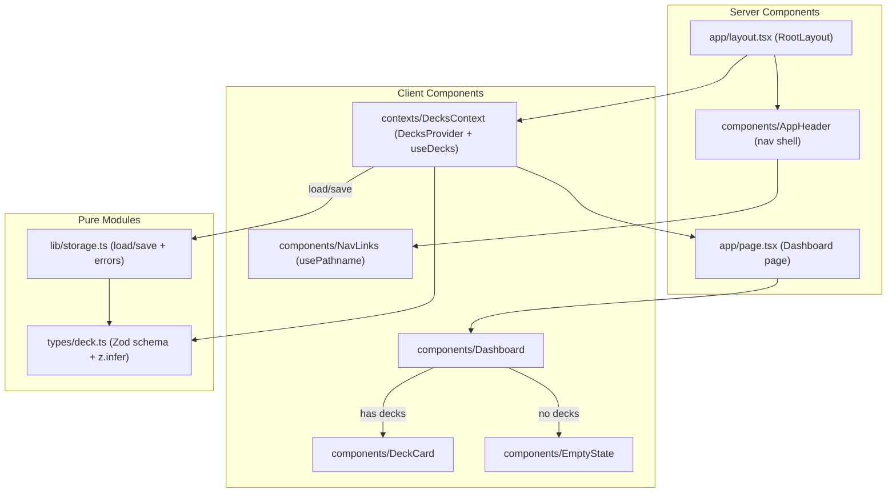
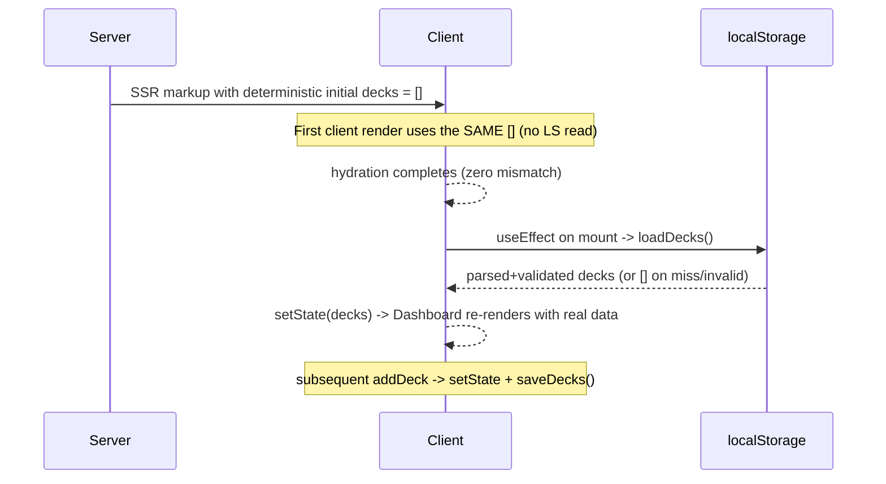

# Design Document

## Overview

The Walking Skeleton is the first vertical slice of a local-first spaced repetition study app. It stands up a thin, demoable, end-to-end path with no domain logic beyond deck bookkeeping:

- An **App Shell** (root layout + `AppHeader`) that renders persistent navigation on every route.
- A **Decks Store** (`DecksProvider` + `useDecks`) that is the single source of truth for the in-memory deck list and mediates all reads/writes.
- A **localStorage persistence module** with Zod validation, a hydration guard, and defensive error handling.
- A **Dashboard** that lists decks via `DeckCard`s or shows an `EmptyState`.
- A **Vitest + React Testing Library** harness (jsdom, `@/*` alias) with property-based and example tests.

The design layers cleanly so every later slice (deck creation, card authoring, review scheduling, import/export) plugs into the same store and persistence seam without rework.

This design targets the verified project scaffold: Next.js `16.3.3` (App Router only), React `19.2.8`, TypeScript strict, Tailwind CSS v4 with the AWS palette already configured, Inter already loaded in `app/layout.tsx`, and the `@/*` alias mapped to the project root. It does **not** re-initialize any of that scaffold.

### Design Principles

- **Server-first.** Layout, page, and presentational components stay Server Components. `"use client"` is added only to the provider and to components that need router hooks or event handlers.
- **One persistence seam.** All localStorage access is funneled through a single module (`lib/storage.ts`) so it can be swapped for IndexedDB or a sync backend later without touching the store or UI.
- **Single source of truth for shape.** The Zod schema is the one definition; the `Deck`/`Card` types are `z.infer`red from it.
- **Hydration safety by construction.** The store always renders the same deterministic initial value on the server and on the first client render; persisted data is applied only inside a mount effect.

### Verified Scaffold Assumptions

| Concern | Verified state | Design impact |
| --- | --- | --- |
| Root layout | `app/layout.tsx` loads Inter via `next/font`, uses `LayoutProps<"/">`, sets `bg-aws-gray-100 text-aws-gray-900 font-sans`, `<body>` is `min-h-full flex flex-col` | Wrap `children` with `DecksProvider` + shell; do not re-init fonts or html/body |
| Palette | `tailwind.config.js` has `theme.extend.colors.aws.*` and `fontFamily.sans` | Use `bg-aws-*`, `text-aws-*` utility tokens directly |
| Alias | `tsconfig.json` `paths: { "@/*": ["./*"] }` | Tests must mirror this alias |
| Home route | `app/page.tsx` is a placeholder marketing page | Replaced by the Dashboard |
| Barrels | `types/index.ts` and `mocks/index.ts` export `{}` | Populate with real exports |

## Architecture

The slice is organized into four layers. Data flows down through props/context; writes flow back up through the store's `addDeck` action, which delegates persistence to the storage module.



### Layering rationale

- **Presentation (`components/`)** knows nothing about localStorage. `Dashboard`, `DeckCard`, and `EmptyState` take data via `useDecks()` (or props in tests), keeping them trivially testable with a mock store.
- **State (`contexts/`)** owns the in-memory list, the add-deck action, hydration timing, and the loading/error status. It is the only client boundary that talks to persistence.
- **Persistence (`lib/storage.ts`)** is a pure, side-effecting module with a narrow API (`loadDecks`, `saveDecks`) returning discriminated results, never throwing to callers.
- **Contract (`types/deck.ts`)** defines the Zod schema; both the store and the storage module validate against it.

### Render / hydration timeline



This ordering is what satisfies Requirement 4 (Hydration Guard): the server and first client render are byte-identical because both use the empty deterministic seed; persisted data is applied strictly after mount.

## Components and Interfaces

### `types/deck.ts` — schema and inferred types

The single source of truth. Defines the Zod schema and infers the types; barrel-exported through `types/index.ts`.

```ts
import { z } from "zod";

export const cardSchema = z.object({
  id: z.string().min(1),
});

export const deckSchema = z.object({
  id: z.string().min(1),
  name: z.string().min(1).max(100),
  description: z.string().max(500).optional(),
  cards: z.array(cardSchema).max(1000),
});

export const deckListSchema = z.array(deckSchema).max(10_000);

export type Card = z.infer<typeof cardSchema>;
export type Deck = z.infer<typeof deckSchema>;
export type DeckList = z.infer<typeof deckListSchema>;
```

`types/index.ts` re-exports these so consumers import via `@/types`:

```ts
export type { Card, Deck, DeckList } from "./deck";
export { cardSchema, deckSchema, deckListSchema } from "./deck";
```

### `lib/storage.ts` — persistence module

Pure boundary over `window.localStorage`. Never throws to the caller; returns discriminated results so the store can surface errors. All access is guarded for SSR (`typeof window === "undefined"`).

```ts
export const DECKS_STORAGE_KEY = "walking-skeleton:decks";

export type LoadResult =
  | { ok: true; decks: DeckList }
  | { ok: false; reason: "empty" | "invalid" };

export type SaveResult =
  | { ok: true }
  | { ok: false; reason: "unavailable" | "quota" | "serialize" };

export function loadDecks(): LoadResult;
export function saveDecks(decks: DeckList): SaveResult;
```

- `loadDecks`: returns `{ ok: true, decks }` when the key exists and parses+validates against `deckListSchema`. Returns `{ ok: false, reason: "empty" }` when the key is missing, and `{ ok: false, reason: "invalid" }` when JSON parsing or schema validation fails. It never throws (Requirements 3.5, 3.6, 4.5, 7.5).
- `saveDecks`: serializes and writes. On `QuotaExceededError` returns `{ ok: false, reason: "quota" }`; on any other write/availability failure returns `{ ok: false, reason: "unavailable" }` (Requirement 3.3).

### `contexts/DecksContext.tsx` — provider and hook

A Client Component (`"use client"`). Holds the deck list, status, and error, plus the `addDeck` action. Exposes `useDecks`.

State shape:

```ts
type DecksStatus = "initial" | "ready" | "error";

interface DecksContextValue {
  decks: DeckList;              // deterministic [] until mount effect runs
  status: DecksStatus;          // "initial" pre-hydration; "ready" after load; "error" on read failure
  error: DecksError | null;     // last surfaced error (name required, duplicate id, persistence, invalid data)
  addDeck: (input: AddDeckInput) => AddDeckResult;
}

interface AddDeckInput {
  name: string;
  description?: string;
  cards?: Card[];
  id?: string;                  // optional; generated via crypto.randomUUID() when absent
}

type AddDeckResult =
  | { ok: true; deck: Deck }
  | { ok: false; error: DecksError };

type DecksError =
  | { code: "name-required"; message: string }
  | { code: "duplicate-id"; message: string }
  | { code: "persistence"; message: string }
  | { code: "invalid-data"; message: string };
```

Behavioral contract:

- **Initial state.** `useState<DeckList>([])` seeds a deterministic empty list. `status` starts `"initial"`. No localStorage read happens during render (Requirements 2.2, 4.1, 4.2).
- **Hydration effect.** A `useEffect(() => { ... }, [])` runs once on mount, calls `loadDecks()`, and on `{ ok: true }` sets the decks and `status = "ready"`; on `reason: "empty"` sets `status = "ready"` with `[]`; on `reason: "invalid"` keeps `[]`, sets `status = "ready"`, and surfaces an `invalid-data` error without throwing (Requirements 3.1, 3.6, 4.4, 4.5, 7.5).
- **`addDeck`.**
  1. Trim `name`; if empty/whitespace-only, return `{ ok: false, error: { code: "name-required" } }` and leave state unchanged (Requirement 2.5).
  2. Resolve `id`: use the supplied id or `crypto.randomUUID()`. If the resolved id already exists in `decks`, return `{ ok: false, error: { code: "duplicate-id" } }` and leave state unchanged (Requirements 2.6, 7.6).
  3. Build the `Deck` (`description` omitted when empty; `cards` defaults to `[]`), append to the end (order preserved), and `setDecks(next)` (Requirement 2.4).
- **Persistence effect.** A `useEffect(() => saveDecks(decks), [decks])` gated so it does not run before the initial load completes (avoids clobbering persisted data with the empty seed). On a failed save it surfaces a `persistence` error and leaves the in-memory list intact (Requirements 3.2, 3.3).
- **Guarded hook.** `useDecks()` reads the context; if the value is the sentinel `undefined` (called outside the provider), it throws `Error("useDecks must be used within a DecksProvider")` (Requirement 2.8).

### App Shell — `app/layout.tsx` + `components/AppHeader`

`RootLayout` stays a Server Component. It renders `AppHeader` (server) and wraps the page `children` in `DecksProvider` (client) around a single `<main>` region (Requirements 1.1, 1.4, 2.7). Following the Next.js guidance to render providers as deep as possible, the provider wraps only `main`, not the whole document.

```tsx
// app/layout.tsx (shape)
export default function RootLayout({ children }: LayoutProps<"/">) {
  return (
    <html lang="en" className={`${inter.variable} h-full antialiased`}>
      <body className="min-h-full flex flex-col bg-aws-gray-100 text-aws-gray-900 font-sans">
        <AppHeader />
        <DecksProvider>
          <main className="flex flex-1 flex-col">{children}</main>
        </DecksProvider>
      </body>
    </html>
  );
}
```

`AppHeader` renders the app name and the primary nav. Because the active-route indicator needs `usePathname`, the nav links are extracted into a small Client Component `NavLinks`, while `AppHeader` itself remains server-rendered chrome.

- `AppHeader`: `bg-aws-squid-ink text-aws-white`, sticky at the top (`sticky top-0`) so it stays visible on desktop and mobile (Requirements 1.6, 1.7). App name shown as visible text (Requirement 1.2).
- `NavLinks` (`"use client"`): renders one `next/link` `<Link>` per destination from a static `NAV_ITEMS` list (at least one, e.g. `{ href: "/", label: "Dashboard" }`) (Requirement 1.3). Uses `usePathname()` to compute the active item. The active item gets `aria-current="page"` **and** a non-color affordance (bottom border / bold weight), satisfying "not color alone" (Requirement 1.8). When the pathname matches no destination, no item is active (Requirement 1.10). Navigation uses `<Link>`, which preserves the shell during client-side transitions (Requirement 1.9).

Layout is mobile-first: header and main stack in a single column by default; `md:` utilities apply the desktop treatment (Requirements 1.5, 1.6).

### Dashboard — `components/Dashboard`, `DeckCard`, `EmptyState`

`app/page.tsx` becomes a thin Server Component that renders `<Dashboard />`.

- `Dashboard` (`"use client"`, because it consumes the store): reads `{ decks, status, error }` from `useDecks()`.
  - `status === "error"`: render an error indication; render neither the listing nor the empty state; prior data is retained in state (Requirement 6.6).
  - `decks.length === 0`: render `EmptyState` and no `DeckCard` (Requirements 5.6, 6.1).
  - `decks.length > 0`: render exactly one `DeckCard` per deck in store order (Requirements 5.1, 5.7). Transitions between empty and populated happen automatically via React re-render on `setDecks` (Requirements 6.4, 6.5).
- `DeckCard` (Server Component; takes a `deck` prop): `bg-aws-white border border-aws-gray-200` card on the `aws-gray-100` page background. Renders the deck name (Requirement 5.2); renders the description only when present and non-empty (Requirements 5.3, 5.4); always renders the card count `deck.cards.length` (Requirement 5.5).
- `EmptyState` (Server Component): message that no decks exist, plus a create-deck entry point and an import-deck entry point (Requirements 6.2, 6.3). For this slice the entry points are present and labelled; their flows are stubs to be implemented in later slices. The create action uses `bg-aws-orange hover:bg-aws-orange-dark text-aws-squid-ink`; import uses `bg-aws-blue hover:bg-aws-blue-dark text-aws-white`.

### `mocks/` — fixtures

Barrel-exported deck fixtures for tests and local development (via `@/mocks`): an empty list, a small 1–3 deck list, decks with and without descriptions, and a deck with zero cards, plus a factory for generating decks in property tests.

## Data Models

### Deck

| Field | Type | Constraints | Requirement |
| --- | --- | --- | --- |
| `id` | `string` | non-empty; unique within the list | 7.1, 2.6, 7.6 |
| `name` | `string` | 1–100 chars (post-trim non-empty) | 7.1, 2.5, 5.2 |
| `description` | `string \| undefined` | optional; 0–500 chars; omitted when empty | 7.1, 5.3, 5.4 |
| `cards` | `Card[]` | 0–1000 items | 7.1, 5.5 |

### Card

| Field | Type | Constraints | Requirement |
| --- | --- | --- | --- |
| `id` | `string` | non-empty | 7.2 |

### DeckList

An ordered array of `Deck`, length 0–10,000 (Requirements 2.1, 3.7). Order is significant and preserved across add and persist/restore.

### Persistence representation

The `DeckList` is stored under the key `walking-skeleton:decks` as `JSON.stringify(decks)`. On load it is `JSON.parse`d and validated with `deckListSchema.safeParse` before it ever reaches the store (Requirement 3.7).

## Correctness Properties

*A property is a characteristic or behavior that should hold true across all valid executions of a system — essentially, a formal statement about what the system should do. Properties serve as the bridge between human-readable specifications and machine-verifiable correctness guarantees.*

The store, persistence, schema, and rendering-from-data logic in this slice are pure, input-driven functions with universal behaviors, so property-based testing applies to them. The purely visual and configuration concerns (responsive layout, contrast, toolchain setup, dev/lint gates) are not amenable to PBT and are covered by example, snapshot, and smoke tests in the Testing Strategy.

### Property 1: Adding a valid deck appends and preserves order

*For any* valid deck list and *any* valid add-deck input (non-empty name after trim, non-duplicate id), adding the deck produces a list equal to the original list followed by the new deck — length increases by exactly one, all prior decks remain in their original order, and the new deck is last.

**Validates: Requirements 2.3, 2.4**

### Property 2: Empty or whitespace-only names are rejected

*For any* deck list and *any* name string consisting solely of whitespace (including the empty string), the add operation is rejected with a `name-required` error and the exposed deck list is left unchanged.

**Validates: Requirements 2.5**

### Property 3: Generated identifiers are unique within the list

*For any* deck list, adding a deck without a caller-supplied identifier assigns an id (via `crypto.randomUUID()`) that does not equal the id of any deck already in the list, so all ids in the resulting list remain distinct.

**Validates: Requirements 2.6**

### Property 4: Duplicate identifiers are rejected

*For any* deck list and *any* add-deck input whose supplied id already exists in the list, the operation is rejected with a `duplicate-id` error, the existing deck is preserved unchanged, and the list is unchanged.

**Validates: Requirements 7.6**

### Property 5: Persistence round-trip preserves the deck list

*For any* valid deck list, saving it to Local_Storage and then loading it back yields a deck list equal to the original (same decks, same fields, same order).

**Validates: Requirements 3.1, 3.2, 3.4, 8.5**

### Property 6: Invalid or missing persisted data loads as empty without throwing

*For any* string contents of the Local_Storage key (including missing key, non-JSON text, and JSON that fails schema validation), loading never throws and yields an empty deck list, surfacing an invalid-data indication when the data was present but unparseable/invalid.

**Validates: Requirements 3.5, 3.6, 4.5, 7.5**

### Property 7: Write failures retain in-memory state and surface an error

*For any* deck list, when the Local_Storage write fails (storage unavailable or quota exceeded), the in-memory deck list is retained unchanged and a persistence error indication is surfaced.

**Validates: Requirements 3.3**

### Property 8: Deck schema validation round-trip

*For any* value that conforms to the Deck constraints (non-empty id, 1–100 char name, optional 0–500 char description, 0–1000 cards each with a non-empty id), parsing it with the Zod deck schema succeeds and returns a value equal to the input; *for any* value violating a constraint, parsing fails.

**Validates: Requirements 7.1, 7.2**

### Property 9: Hydration determinism of the initial deck list

*For any* contents of Local_Storage, the deck list exposed by the store before its first client mount completes equals the deterministic initial list (the empty list) that the server rendered — the store does not read Local_Storage during render.

**Validates: Requirements 4.1, 4.2**

### Property 10: One DeckCard per deck in store order

*For any* non-empty deck list provided by the store, the Dashboard renders exactly one DeckCard per deck and the rendered order matches the store's order.

**Validates: Requirements 5.1, 5.7**

### Property 11: DeckCard renders name and card count

*For any* deck, its DeckCard renders the deck's name as visible text and renders a card count equal to the number of cards in the deck (0 when empty).

**Validates: Requirements 5.2, 5.5**

### Property 12: DeckCard renders description conditionally

*For any* deck, its DeckCard renders the description text exactly when the description is present and non-empty, and renders no description region when the description is absent or empty — while still rendering the name and card count in both cases.

**Validates: Requirements 5.3, 5.4**

### Property 13: Active navigation destination reflects the current route

*For any* pathname, the navigation marks a destination active (via `aria-current="page"` plus a non-color affordance) if and only if that destination's href matches the pathname; when no destination matches, no destination is marked active.

**Validates: Requirements 1.8, 1.10**

## Error Handling

Errors are handled defensively so the walking skeleton never crashes the render and always degrades to a usable state.

| Scenario | Handling | Requirement |
| --- | --- | --- |
| `useDecks` called outside provider | Throw a descriptive `Error` (developer-facing, fail-fast) | 2.8 |
| Add deck with empty/whitespace name | Return `{ ok: false, error: { code: "name-required" } }`; state unchanged | 2.5 |
| Add deck with duplicate id | Return `{ ok: false, error: { code: "duplicate-id" } }`; state unchanged | 7.6 |
| localStorage write fails (quota/unavailable) | `saveDecks` returns a failure result; store keeps in-memory list, sets `error` (code `persistence`) | 3.3 |
| localStorage read missing | `loadDecks` returns `{ ok: false, reason: "empty" }`; store initializes `[]`, `status = "ready"` | 3.5 |
| localStorage read unparseable/invalid | `loadDecks` returns `{ ok: false, reason: "invalid" }`; store keeps `[]`, sets `error` (code `invalid-data`), does not throw, no hydration warning | 3.6, 4.5, 7.5 |
| Store cannot be read at Dashboard render | `status === "error"`: render error indication, no listing, no empty state; retain prior data | 6.6 |
| Unknown route | Shell still renders header + main; no nav destination active | 1.10 |

Design decisions:

- **Results over exceptions at the persistence boundary.** `loadDecks`/`saveDecks` return discriminated unions rather than throwing, so the store can branch deterministically and never leaks an exception into render (critical for the no-hydration-warning requirement).
- **The provider throw is intentional.** Using `useDecks` outside the provider is a programming error, so failing fast with a clear message is the right call — unlike persistence failures, which are expected runtime conditions.
- **Errors never mutate good state.** Every rejection/failure path leaves the last valid in-memory list intact (Requirements 2.5, 3.3, 6.6, 7.5, 7.6).

## Testing Strategy

Tooling: **Vitest** with the **jsdom** environment, **React Testing Library** + `@testing-library/jest-dom`, and a property-based library (**fast-check**) for the properties above. These are added as pinned dev dependencies; **zod** is added as a pinned runtime dependency (Requirements 9.5, 9.6).

### Harness configuration

- `vitest.config.ts` sets `test.environment = "jsdom"`, `test.globals = true`, and `test.setupFiles = ["./vitest.setup.ts"]`. The `@/*` alias is resolved via `vite-tsconfig-paths` (or an explicit `resolve.alias` mapping `@` → project root) so imports resolve identically to the Next.js build (Requirements 8.1, 8.3). An unresolved `@/…` import fails the test with a module-resolution error (Requirement 8.4).
- `vitest.setup.ts` imports `@testing-library/jest-dom` and clears `localStorage` and mocks between tests. A jsdom `localStorage` is available by default; quota/unavailable failures are simulated by spying on `Storage.prototype.setItem` / `getItem`.
- Scripts: add `"test": "vitest run"` (single execution, not watch) so the suite completes and returns within budget (Requirements 8.8, 8.9). RTL is available for rendering and assertions (Requirement 8.2).

> Note: `vitest --watch`, `next dev`, and other long-running commands are run manually by the developer, not as part of automated verification.

### Property-based tests

Each property in the Correctness Properties section is implemented by a **single** fast-check property configured for **at least 100 iterations** (`{ numRuns: 100 }`), tagged with a comment in the form:

`// Feature: walking-skeleton, Property {number}: {property_text}`

Generators (arbitraries):
- `arbDeck`: id (non-empty string), name (1–100 chars), optional description (0–500 chars, sometimes empty/absent), cards (0–20 sampled, each non-empty id) — bounded well within the 1000/10,000 limits for speed while still exercising ranges. A separate large-list arbitrary exercises sizes near the 10,000 bound for the persistence round-trip.
- `arbWhitespaceName`: strings composed only of whitespace characters (including empty), for Property 2.
- `arbGarbageStorage`: arbitrary strings plus structurally-invalid JSON objects, for Property 6.
- `arbPathname`: destination hrefs and arbitrary non-matching paths, for Property 13.

| Property | Test focus | Notes |
| --- | --- | --- |
| P1 | `addDeck` append/order/size | pure reducer over `arbDeck` list + input |
| P2 | whitespace-name rejection | `arbWhitespaceName`; assert state unchanged + error |
| P3 | generated-id uniqueness | assert new id ∉ existing ids |
| P4 | duplicate-id rejection | inject an existing id; assert unchanged + error |
| P5 | `saveDecks`→`loadDecks` round-trip | jsdom localStorage; deep-equal |
| P6 | invalid/missing load resilience | `arbGarbageStorage`; never throws, returns `[]` |
| P7 | write-failure resilience | mock `setItem` to throw quota/unavailable; state retained |
| P8 | deck schema validation round-trip | valid parses to equal value; invalid rejected |
| P9 | hydration determinism | render provider with seeded LS; pre-effect value is `[]` |
| P10 | DeckCard count/order | render Dashboard with `arbDeck` list; count + order |
| P11 | DeckCard name + count content | rendered text contains name and count |
| P12 | DeckCard description conditional | present iff non-empty description |
| P13 | active nav rule | active iff href === pathname; else none active |

### Example, integration, and smoke tests

Required explicit tests (Requirement 8) in addition to the property suite:

- **Round-trip example (8.5):** add one deck through the store, persist, re-initialize the store from localStorage, assert exactly one deck matching the added deck's id and content. (Concrete instance of Property 5.)
- **Dashboard listing example (8.6):** render the Dashboard with a mock store of 1–3 decks; assert every deck renders and the rendered count equals the mock count. (Concrete instance of Property 10.)
- **Dashboard empty-state example (8.7):** render the Dashboard with a mock store of 0 decks; assert the `EmptyState` renders and no `DeckCard` renders.

Other example/smoke coverage mapped to non-property criteria:

| Criterion(s) | Test type | What it checks |
| --- | --- | --- |
| 1.1–1.4 | RTL example | Header + single main region present on a route |
| 1.9 | RTL example | Nav items are `<Link>`s with correct `href`; header persists |
| 2.2 | RTL example | Empty list pre-hydration |
| 2.8 | RTL example | `useDecks` outside provider throws |
| 4.3 | RTL example | Spy on `console.error`; assert no hydration-mismatch warning on first render |
| 4.4 | RTL example | With seeded LS, exposed list updates to persisted data after mount effect |
| 6.2, 6.3 | RTL example | `EmptyState` shows create + import entry points |
| 6.4, 6.5 | RTL example | Toggling store 0↔1+ swaps listing and empty state |
| 6.6 | RTL example | `status === "error"` renders error, neither listing nor empty state |
| 1.5–1.7 | Manual/visual | Mobile single-column, desktop sticky header, palette contrast |
| 7.3, 7.4 | Compile-time | `@/types` exports resolve; `z.infer` type is assignable (type check) |
| 8.1–8.4, 8.8, 8.9 | Smoke | Suite runs under jsdom, alias resolves, all pass, within 60s |
| 9.1–9.4 | Smoke | `npm run dev` serves `/`; `npm run lint` exit codes |
| 9.5, 9.6 | Smoke | Pinned deps present in `package.json` |

### Why PBT is scoped, not universal, here

PBT is applied to the store reducer, persistence round-trip, schema validation, and render-from-data logic because those have meaningful input variation and universal invariants. It is deliberately **not** applied to responsive layout, color contrast, framework navigation wiring, or toolchain/dev/lint gates — those are one-shot configuration or visual concerns where 100 randomized iterations add no signal, so they use example, snapshot, or smoke tests instead.
