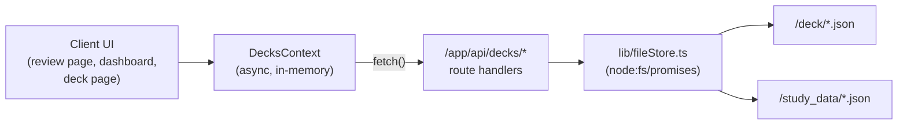

**Implementation Plan — File-Based Deck Persistence**

**Problem Statement**

Replace browser `localStorage` persistence with server-side file storage. Decks live as JSON files in `/deck/<snake_case_name>.json`; study session results are exported to `/study_data/<snake_case_name>.json` (overwriting); on startup decks load from both folders with `/study_data` taking precedence; a reset option deletes a deck's `/study_data` file. `localStorage` is removed entirely.

**Requirements (from our Q&A)**

1. A new deck creates a JSON file named from its snake_case name in `/deck`.
2. A new card is saved into its deck's `/deck/<name>.json` file (per-operation write, answer 1=a).
3. When a study session finishes, the deck is exported to `/study_data/<name>.json`, overwriting any existing file.
4. On startup, load decks from `/deck` and `/study_data`, unioned by filename, with `/study_data` winning on conflict (answer 3=a).
5. A reset option deletes the deck's file from `/study_data` only; the deck reverts to its `/deck` version on next load (answer 3=a).
6. Filename derives from the deck name in snake_case (answer 2=b). Cross-folder matching is by filename (answer 2=a). Same-folder filename collisions get a numeric suffix `_2`, `_3` (answer 1=a).
7. All data is stored/retrieved from files; `localStorage` is no longer used.

**Background (findings from the codebase)**

- The app is currently 100% client-side. `lib/storage.ts` is the sole persistence seam over `window.localStorage`. `DecksContext` (a Client Component) hydrates once in a mount effect via `loadDecks()` and writes the entire deck list via `saveDecks()` on every `[decks]` change.
- Domain shape and validation are centralized in `types/deck.ts` (Zod schemas → `z.infer` types). Leitner scheduling lives in `lib/leitner.ts`. `lib/deckIO.ts` already has `serializeDeck`/`parseDeck` (pretty JSON + schema validation).
- The store exposes `addDeck`, `updateDeck`, `replaceDeck`, `deleteDeck`, `addCard`, `updateCard`, `deleteCard`, `gradeCardCorrect`, `gradeCardIncorrect`, plus `decks`, `status`, `error`.
- Study sessions run in `app/deck/[id]/review/page.tsx`; grading calls the store per card and completion is marked in `reviewState.completed`. Today it shows an `ExportControl` (browser download) on completion — this is the natural hook for the `/study_data` export.
- Routing keys off deck `id` (`/deck/[id]`). To keep matching, file naming, and routing on one key, the deck `id` will be set equal to the snake_case filename stem.
- Next.js 16 route handlers: `route.ts` under `/app/api`, `Response.json()`, dynamic params via `await ctx.params` typed with `RouteContext<'/...'>`. `fs` runs only on the server, so all file I/O lives behind route handlers.

**Proposed Solution**

Introduce a server-side file-storage seam (`lib/fileStore.ts`) using `node:fs/promises`, exposed through REST route handlers under `/app/api/decks`. Convert `DecksContext` from a synchronous localStorage store into an async, server-backed store: it loads once via `GET /api/decks` and performs each mutation via a matching route handler, updating in-memory state from the server response. Study completion calls a dedicated export endpoint; reset calls a delete endpoint. Remove `lib/storage.ts` and its tests.

Identity model: the snake_case filename stem is the deck's `id`. On create/rename, compute the stem from the name and resolve same-folder collisions with a numeric suffix. Cross-folder union matches by filename stem, `/study_data` winning.

Route surface:
- `GET /api/decks` — union-load both folders (study_data precedence). Returns `DeckList`.
- `POST /api/decks` — create deck (writes `/deck/<name>.json`, resolving collisions).
- `PUT /api/decks/[id]` — update/replace a deck (deck-level edits, card add/update/delete, grading — all write the full deck file).
- `DELETE /api/decks/[id]` — delete deck (removes `/deck` file).
- `POST /api/decks/[id]/export` — export deck to `/study_data/<name>.json` (overwrite). Called on session finish.
- `DELETE /api/decks/[id]/study-data` — reset: delete `/study_data/<name>.json`.

**Task Breakdown**

Following the instruction: each task is a working, test-driven, demoable increment that builds on the previous one and ends wired in — no orphaned code.

- [ ] **Task 1: Filename derivation + collision utilities (`lib/deckPaths.ts`)**
  Objective: Create a framework-agnostic module that converts a deck name to a snake_case filename stem, sanitizes it, and resolves same-folder collisions against a set of existing stems by appending `_2`, `_3`, etc. Also expose helpers to build absolute paths into `/deck` and `/study_data` (guarding that paths stay inside those folders).
  Guidance: Pure functions, no `fs`. Keep constants for the two directory names. Lowercase, trim, collapse non-alphanumerics to single underscores, strip leading/trailing underscores, enforce non-empty fallback (e.g. `deck`).
  Tests: Colocated `deckPaths.test.ts` unit tests plus a `fast-check` property test (idempotent slug, output always matches `^[a-z0-9_]+$`, collision output is unique vs the provided set). Use the `/test` arbitraries convention.
  Demo: Run the suite showing `"My French Deck!" → my_french_deck` and a collision resolving to `my_french_deck_2`.

- [ ] **Task 2: Server file-storage seam (`lib/fileStore.ts`)**
  Objective: Implement the only module that touches the filesystem, using `node:fs/promises`. Functions: `loadAllDecks()` (read `/deck` and `/study_data`, parse+validate each via `deckSchema`, union by filename stem with study_data precedence, skip invalid files without throwing), `writeDeckFile(deck)` (write pretty JSON to `/deck/<stem>.json`), `deleteDeckFile(id)`, `exportDeckToStudyData(deck)` (overwrite `/study_data/<stem>.json`), `deleteStudyDataFile(id)`. Ensure directories exist (`mkdir recursive`). Return discriminated results (`{ ok: true, ... } | { ok: false, reason }`) — never throw to callers.
  Guidance: Reuse `serializeDeck`/`deckSchema` from `lib/deckIO.ts` and `types`. Set each loaded deck's `id` to its filename stem. Keep this server-only (no `"use client"`; it will only be imported by route handlers).
  Tests: `fileStore.test.ts` writing to a temp directory (inject/override the base dir via a parameter or env for testability). Cover: round-trip write/read, study_data precedence on filename conflict, invalid file skipped, missing-folder handling.
  Demo: A test that writes a deck to a temp `/deck`, copies a modified version into temp `/study_data`, and shows `loadAllDecks()` returns the study_data version.

- [ ] **Task 3: Read endpoint + context load path (`GET /api/decks`, `DecksContext` hydration)**
  Objective: Add `app/api/decks/route.ts` with a `GET` that calls `loadAllDecks()` and returns `Response.json(decks)`. Rework `DecksContext` hydration: replace the `loadDecks()` localStorage effect with a mount effect that `fetch("/api/decks")`, validates with `deckListSchema`, and sets `decks`/`status`. Keep the deterministic empty seed and `status` state machine (`initial → ready/error`) so existing phase-gating (`useStorePhase`) and loading UI keep working.
  Guidance: Mark the route dynamic (no caching) so it always reads fresh files. Keep mutations untouched in this task (they can stay in-memory temporarily) so the app still renders. Handle fetch failure → `status: "error"`.
  Tests: Route handler unit test (mock `fileStore`) asserting JSON shape and status codes. Update `DecksContext.hydration-determinism` / behavior tests to stub `fetch` instead of localStorage.
  Demo: Manually drop a JSON file in `/deck`, run `npm run dev`, and see the dashboard list it on load.

- [ ] **Task 4: Create + delete deck endpoints wired into the store (`POST /api/decks`, `DELETE /api/decks/[id]`)**
  Objective: Implement `POST /api/decks` (validate body with `deckFormSchema`/`deckSchema`, compute stem, resolve collisions against existing `/deck` stems, write file, return the created deck) and `DELETE /api/decks/[id]` (delete `/deck` file). Convert `DecksContext.addDeck` and `deleteDeck` to async: call the endpoint, then update in-memory state from the response; surface `persistence`/`duplicate-id`/`validation` errors as today.
  Guidance: `id` returned by the server (the stem) becomes the deck's id used for routing. Update `AddDeckResult`/`DeleteDeckResult` and callers (`Dashboard`, `DeckForm`, `DeleteConfirm`, `ImportControl`) to await. Use `RouteContext<'/api/decks/[id]'>` and `await ctx.params`.
  Tests: Route handler tests for create (happy path, collision suffix, invalid body → 400) and delete (missing → 404). Update `DecksContext` create/delete tests to stub `fetch`.
  Demo: Create a deck in the UI and see `/deck/<name>.json` appear on disk; delete it and see the file removed.

- [ ] **Task 5: Update/replace endpoint for deck edits and card mutations (`PUT /api/decks/[id]`)**
  Objective: Implement `PUT /api/decks/[id]` that accepts a full validated `Deck` and writes it to `/deck/<stem>.json` (overwrite). Convert `updateDeck`, `replaceDeck`, `addCard`, `updateCard`, `deleteCard` to compute the next deck state in-memory, then persist via `PUT` per-operation, updating state from the response. Handle name changes: if the stem changes on `updateDeck`, write the new file and delete the old one (rename = move), keeping cross-folder-by-filename semantics we agreed on.
  Guidance: Keep the Zod validation and Leitner logic exactly as-is; only the persistence side changes. Preserve `not-found` and `validation` error codes. Ensure callers (`DeckForm`, `CardForm`, `CardItemActions`, `ImportControl` replace path) await the async results.
  Tests: Route handler tests (valid update, rename moves file, 404, 400). Update the card-create/update/delete and update/replace context tests to stub `fetch`.
  Demo: Add a card to a deck and see it persisted in the deck's JSON file; rename a deck and see the file renamed.

- [ ] **Task 6: Grading persistence during review**
  Objective: Route `gradeCardCorrect`/`gradeCardIncorrect` through the same `PUT /api/decks/[id]` persistence so each grade updates the deck file immediately (answer 1=a). Ensure the review page's per-card grading handlers await persistence and keep the existing error handling (`gradeError` → in-view `ErrorState`, no advance on failure).
  Guidance: Reuse the Task 5 persistence path; grading only changes card box/lastReviewed via existing Leitner functions before the write. Make the grade handlers in `review/page.tsx` async-aware.
  Tests: Update `DecksContext.grade-card` and `review.property`/`review.integration` tests to stub `fetch`; assert a write happens per grade and failures don't advance the session.
  Demo: Grade a card during review and see the box/lastReviewed change reflected in the deck's `/deck/<name>.json` file.

- [ ] **Task 7: Study-session export on completion (`POST /api/decks/[id]/export`)**
  Objective: Implement `POST /api/decks/[id]/export` that writes the current deck to `/study_data/<stem>.json`, overwriting. Trigger it when the review session reaches `completed`. Replace the browser-download `ExportControl` on the completion screen with an automatic server export plus a clear status/confirmation message (and a retry on failure).
  Guidance: Fire the export once on transition to `completed` (guard against double-fire). Keep the completion summary UI and copy; swap the "Save your progress" block for export status. Follow UI-patterns/visual-identity for messaging (semantic colors + text, not color alone).
  Tests: Route handler test (overwrite existing study_data file). Update `export-reminder.test.tsx` and `review.integration.test.tsx` to assert the export call fires on completion and handles failure.
  Demo: Finish a review session and see `/study_data/<name>.json` created/overwritten with the post-session state.

- [ ] **Task 8: Reset endpoint + UI (`DELETE /api/decks/[id]/study-data`)**
  Objective: Implement `DELETE /api/decks/[id]/study-data` that deletes `/study_data/<stem>.json` (no-op if absent). Add a "Reset deck" action in the deck page UI (with a confirmation, reusing the `DeleteConfirm` pattern) that calls the endpoint, then re-loads decks so the deck reverts to its `/deck` baseline. Add a `resetDeck` method to `DecksContext`.
  Guidance: Reset only touches `/study_data`. After deletion, refetch via `GET /api/decks` (or targeted refresh) so in-memory state reflects the `/deck` version. Place the action per UI-patterns (deck-page/contextual affordance, not in `AppHeader`); reserve `aws-orange` appropriately and treat reset as a destructive-styled confirm.
  Tests: Route handler test (delete existing, no-op when missing). Context test for `resetDeck` (stubbed `fetch`). Component test for the confirm + reset flow.
  Demo: Study a deck (creating a study_data file), then reset it and confirm the study_data file is gone and the deck shows its `/deck` state after reload.

- [ ] **Task 9: Remove localStorage seam and finalize**
  Objective: Delete `lib/storage.ts` and its tests (`storage.test.ts`, `storage.property.test.ts`, `storage.write-failure.test.ts`), remove the `DECKS_STORAGE_KEY`/`loadDecks`/`saveDecks` imports, and purge any remaining `localStorage` references. Ensure `.gitignore` handles `/deck` and `/study_data` as appropriate (decide whether generated study data is committed). Confirm `DecksContext` no longer writes the whole list anywhere.
  Guidance: Grep for `localStorage`, `DECKS_STORAGE_KEY`, `saveDecks`, `loadDecks` and remove all usages. Keep `deckIO.ts` (still used server-side).
  Tests: Full `npm run test`, `npm run lint`, and `npm run build` all green. Add/adjust an integration test proving no `localStorage` access remains in the client path.
  Demo: Clean build + full test suite passing; the app runs entirely on file storage with `localStorage` gone.

**Verification strategy**

Each task runs its colocated Vitest tests. Route handlers are tested against a temp directory injected into `fileStore`. After Task 9, run `npm run lint`, `npm run test`, and `npm run build` to confirm the whole thing is green and integrated.
